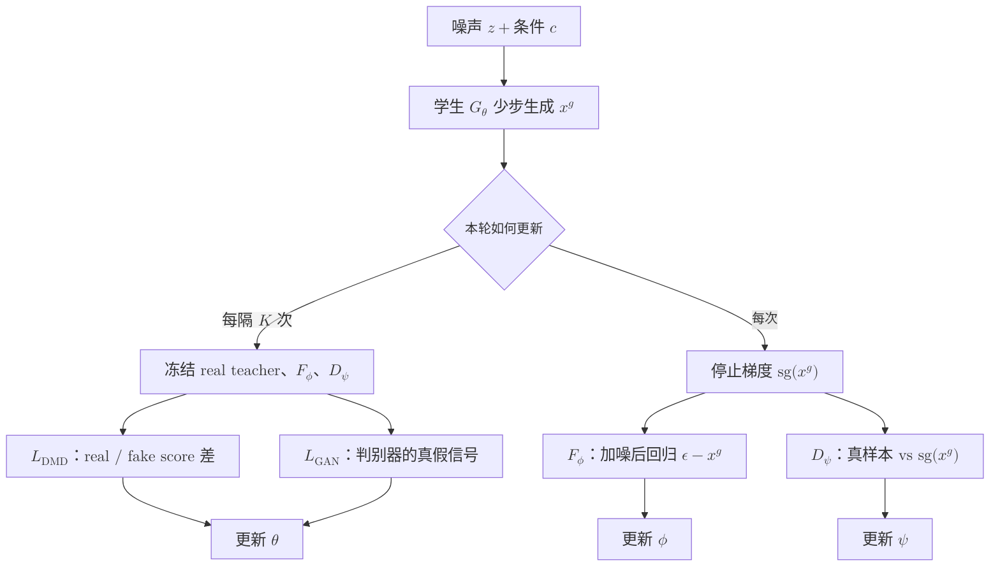
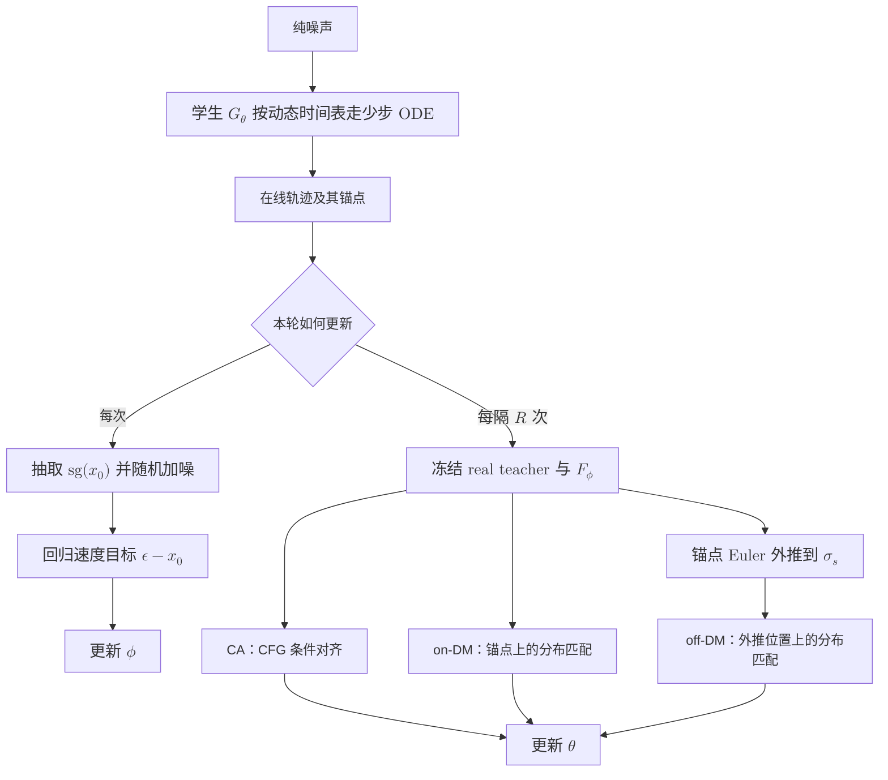

# 扩散模型的少步蒸馏：从分布匹配到连续时间

一个扩散模型可能训练得很好，却要调用几十次才能生成一张图。少步蒸馏要解决的就是这笔推理成本：训练一个学生，让它用一两步或少数几步，复现老师长轨迹最终形成的分布。

最直接的做法是回归老师生成的图片，但这会把“一对多”的生成问题压成“一对一”。Distribution Matching Distillation（DMD）换了一个目标：不追老师的某条轨迹，只追老师的分布。Continuous-Time Distribution Matching（CDM）沿着这条线继续向前，把约束从少数离散时间点铺到学生的连续轨迹上。

这篇文章只讲这条蒸馏路线：

```text
逐点回归 → DMD 的分布匹配 → CDM 的连续时间分布匹配
```

## 0. 预备知识：flow matching 在预测什么

先统一记号。设干净样本为 $x_0$，高斯噪声为 $\epsilon$，用噪声强度 $\sigma\in[0,1]$ 构造直线路径：

$$
x_\sigma=(1-\sigma)x_0+\sigma\epsilon.
$$

$\sigma=0$ 时是数据，$\sigma=1$ 时接近纯噪声。对应的速度目标为

$$
v^*(x_\sigma,\sigma)=\epsilon-x_0.
$$

模型预测速度 $v_\theta$ 后，可以直接估计这条路径对应的干净样本：

$$
\hat{x}_0=x_\sigma-\sigma v_\theta(x_\sigma,\sigma).
$$

推理时，Euler 更新可以写成

$$
x_{\sigma'}=x_\sigma+(\sigma'-\sigma)v_\theta(x_\sigma,\sigma),\qquad \sigma'<\sigma.
$$

普通模型需要很多个很小的 $\sigma\to\sigma'$ 更新。DMD 和 CDM 的目标，都是让学生在步长很大时仍能落到正确的生成分布上。

## 1. 蒸馏的起点：不追轨迹，只追分布

### 1.1 从逐点回归到分布匹配

最直观的蒸馏方法，是先让老师从同一个噪声出发跑很多步，再让学生回归老师的最终输出。这种方法监督明确，但也有局限：老师轨迹的生成成本高，而且同一个 prompt 可以对应许多合理图片，逐点回归会把本来是“一对多”的生成问题压成“一对一”。

Distribution Matching Distillation（DMD）不要求学生复刻某一条老师轨迹。它只要求学生生成分布 $p_{\text{fake}}$ 接近老师或真实数据分布 $p_{\text{real}}$。其核心梯度来自两个 score 的差：

$$
\nabla_{x}D_{\mathrm{KL}}(p_{\text{fake}}\|p_{\text{real}})
\propto s_{\text{fake}}(x_\sigma,\sigma)-s_{\text{real}}(x_\sigma,\sigma).
$$

这里有两个“老师”：

- real teacher 是冻结的预训练模型，描述目标分布；
- fake teacher 是持续训练的扩散模型，拟合学生此刻产生的分布。

为什么必须有 fake teacher？因为仅知道目标分布往哪里推还不够。$s_{\text{fake}}$ 刻画学生当前分布已经在哪里，两个 score 相减才给出“从当前分布走向目标分布”的方向。当二者相等时，分布匹配梯度为零。

### 1.2 在 flow matching 中怎样得到这个方向

训练时不必显式计算概率密度。学生先从噪声生成 $x_0^g=G_\theta(z,c)$，再随机选择 $\sigma$，把它重新加噪成

$$
x_\sigma^g=(1-\sigma)x_0^g+\sigma\epsilon.
$$

real teacher 和 fake teacher 分别从同一个 $x_\sigma^g$ 预测速度，再换算为干净样本估计：

$$
\hat{x}_0^{\text{real}}=x_\sigma^g-\sigma v_{\text{real}},\qquad
\hat{x}_0^{\text{fake}}=x_\sigma^g-\sigma v_{\text{fake}}.
$$

于是学生的更新方向可以写成

$$
g=\frac{\hat{x}_0^{\text{real}}-\hat{x}_0^{\text{fake}}}{Z},
$$

其中 $Z$ 是按样本计算的归一化因子，用来稳定不同噪声强度下的梯度尺度。训练时对 $g$ 停止梯度，再构造一个等价的伪回归目标：

$$
L_{\text{DMD}}
=\frac12\left\|x_0^g-\operatorname{sg}(x_0^g+g)\right\|_2^2.
$$

这个 MSE 只是把分布匹配方向传给学生的工具，并不意味着学生在回归某张真实图片。真正决定方向的仍是 real/fake 两个分布估计之差。

### 1.3 四个角色，最多三组可训练参数

fake teacher 的训练数据来自学生：对 $x_0^g$ 加噪后，以 $\epsilon-x_0^g$ 为速度目标做普通 flow matching 损失。学生一更新，$p_{\text{fake}}$ 就发生变化，fake teacher 因而必须不断跟随。

到了 DMD2，训练中实际存在四个角色，其中最多有三组参数参与更新：

- **real teacher**：冻结的预训练模型，只负责给出目标分布的 score；
- **student / generator $G_\theta$**：最终要保留下来的少步生成器；
- **fake teacher $F_\phi$**：可训练的去噪模型，估计学生当前分布在各个噪声时刻的 score；
- **GAN discriminator $D_\psi$**：可选的真假分类器，用真实样本与学生样本训练。

fake teacher 和 discriminator 很容易被混为一谈，但二者并不等价。$F_\phi$ 接收带噪状态和时间，输出速度或 score，回答“学生分布在这里朝哪个方向变化”；$D_\psi$ 输出一个真假 logit，回答“这个样本更像真实数据还是生成数据”。前者构造 DMD 的分布梯度，后者提供直接来自真实数据的密度比信号。

### 1.4 GAN 的作用

只使用 DMD 梯度时，目标方向依赖冻结老师给出的 score。预训练老师并不等于真实数据分布本身，它的 score 估计误差会被学生继承；少步生成器还可能利用这些误差，落到老师判断尚可、真实感却不足的区域。

因此 DMD2 增加了一个轻量的对抗分支。判别器在真实样本 $x^{\text{real}}$ 与停止梯度的学生样本 $x^g$ 上最小化 logistic loss：

$$
L_D
=\mathbb{E}\left[\operatorname{softplus}(-D_\psi(x^{\text{real}}))\right]
+\mathbb{E}\left[\operatorname{softplus}(D_\psi(\operatorname{sg}(x^g)))\right].
$$

学生则增加对应的 non-saturating generator loss：

$$
L_{\text{GAN}}^G
=\mathbb{E}\left[\operatorname{softplus}(-D_\psi(x^g))\right].
$$

更新学生时冻结判别器参数，但保留 $D_\psi(x^g)$ 对 $x^g$ 的梯度，使真假信号能够传回 $G_\theta$。有些实现会先给真假 latent 加入随机强度的噪声再判别，这相当于让判别器在多个噪声尺度上比较两种分布，而不是死盯干净样本的局部纹理。

最终的学生目标可以概括为

$$
L_G=\lambda_{\text{DM}}L_{\text{DMD}}
+\lambda_{\text{GAN}}L_{\text{GAN}}^G.
$$

DMD 项提供老师分布与学生分布之间的方向，GAN 项把这个方向重新锚定到真实数据。GAN 是校正项，不是用判别器替代 real/fake score difference。

### 1.5 一次训练迭代怎样更新

把反向传播边界写清楚后，整个循环并不复杂：



更新学生时，real teacher、fake teacher 和 discriminator 的参数全部冻结，但它们对学生输出给出的梯度方向仍会传给 $G_\theta$。随后学生样本停止梯度，用来训练另外两组参数：$F_\phi$ 通过去噪损失追踪当前的 $p_\theta$，$D_\psi$ 通过真假分类损失学习数据分布与生成分布的差别。代码里这两项常被合并进同一个 guidance/critic optimizer step，但它们仍是作用不同的两种损失。

这里的 $K$ 体现 TTUR（Two-Time-Scale Update Rule）：critic 和判别器可以每次迭代都更新，学生则每隔若干次再更新。例如 $K=5$ 表示 guidance 连续更新五次，学生只更新一次。原因是学生一动，fake teacher 要拟合的分布也跟着动；若二者同速甚至学生更快，$s_{\text{fake}}$ 会长期滞后，学生拿到的就不是当前分布与目标分布之差。TTUR 的要点不是固定采用 $5{:}1$，而是让分布估计器有时间追上移动中的生成器。

DMD2 去掉昂贵的逐点回归后，正是靠这组不对称更新维持训练：real teacher 始终不动，fake teacher 快速跟随学生，判别器持续观察真假样本，学生在较慢的时间尺度上同时接收分布匹配与对抗梯度。

### 1.6 少步学生的训练分布问题

训练多步学生时，还有一个容易被忽略的问题。若直接对真实图加噪，学生看到的是 $q(x_\sigma\mid x_0^{\text{real}})$；推理时它看到的却是自己上一大步产生的中间状态。步数越少，每一步误差越大，两种输入分布的差距也越明显。

DMD2 的 backward simulation 先让学生从纯噪声沿自己的少步轨迹回放，再从中抽取中间状态训练。这样，学生看到的就是推理时真正会遇到的输入分布。它解决的是 exposure bias，而不是改变 DMD 的分布匹配目标。

## 2. 蒸馏的延伸：把约束铺到连续时间

### 2.1 离散锚点留下了什么空隙

DMD 可以把几十步压到固定的 4 步或 8 步，但如果训练只约束几个预设时间点，学生便可能记住这些离散跳跃，而没有学到锚点之间完整、平滑的速度场。换一组采样时间，或者让单步跨度变大，累积误差就可能迅速暴露出来。

CDM 的全称是 Continuous-Time Distribution Matching。它把问题拆成两部分：先用动态的连续时间表覆盖学生真实会经过的轨迹，再把约束从轨迹上的锚点延伸到锚点之间的连续位置。目标不是让两个预测在数值上简单相等，而是让这些位置对应的生成分布都朝目标数据分布对齐。

### 2.2 先从学生自己的 ODE 轨迹取样

训练开始时，随机采样一组连续时间锚点，再用当前学生从纯噪声沿 ODE 反向生成：

$$
x_{\sigma_{i+1}}
=x_{\sigma_i}+(\sigma_{i+1}-\sigma_i)v_\theta(x_{\sigma_i},\sigma_i).
$$

这条轨迹不是固定网格，而是每次都采用不同的连续时间表。训练从中随机选一个状态 $(x_{\sigma_i},\sigma_i)$，使监督覆盖学生自己产生的中间状态，而不只是对真实图片加噪得到的理想状态。

接着再选择一个更小的连续噪声强度 $\sigma_s\leq\sigma_i$，用锚点处的速度做一次 Euler 外推：

$$
\tilde{x}_{\sigma_s}
=x_{\sigma_i}+(\sigma_s-\sigma_i)v_\theta(x_{\sigma_i},\sigma_i),
$$

再让学生在 $(\tilde{x}_{\sigma_s},\sigma_s)$ 上重新预测

$$
\hat{x}_0^s=\tilde{x}_{\sigma_s}-\sigma_s v_\theta(\tilde{x}_{\sigma_s},\sigma_s).
$$

这里的 $\tilde{x}_{\sigma_s}$ 一般不在原本的离散轨迹上，因此是一个 off-trajectory latent。它主动暴露了一个问题：锚点处预测的速度，能否把状态带到锚点之间仍然合理的位置？如果不能，模型即使在所有锚点上表现正常，大步采样时仍会在两个锚点之间偏离。

### 2.3 从锚点内匹配到锚点间匹配

无论约束的是轨迹锚点，还是外推得到的连续位置，CDM 都不需要找一张目标图片做像素回归。以外推位置为例，先由学生得到 $\hat{x}_0^s$，再随机选择 teacher noise $\sigma_t$：

$$
x_{\sigma_t}=(1-\sigma_t)\operatorname{sg}(\hat{x}_0^s)+\sigma_t\epsilon.
$$

real teacher 与 fake teacher 在这个点分别给出 $\hat{x}_0^{\text{real}}$ 和 $\hat{x}_0^{\text{fake}}$，随后沿用 DMD 的分布匹配方向：

$$
g_{\text{CDM}}
=\frac{\hat{x}_0^{\text{real}}-\hat{x}_0^{\text{fake}}}{Z}.
$$

因此，DMD 与 CDM 的主要差别不在最后的损失形式，而在“从哪里产生要被约束的学生样本”：

| 方法 | 学生样本的位置               | 学到的能力                         |
| ---- | ---------------------------- | ---------------------------------- |
| DMD  | 生成器输出或固定少步轨迹     | 让少步生成分布接近目标分布         |
| CDM  | 动态轨迹锚点及其间的外推位置 | 让连续时间上的速度场都指向合理分布 |

### 2.4 三种约束各自解决什么

CDM 的训练可以理解为三种互补约束：

1. **CFG augmentation（CA）**：老师分别做 conditional 与 unconditional 预测，把 classifier-free guidance 的方向交给只运行 conditional 分支的学生。它主要对齐文本条件，避免加速后条件控制变弱。
2. **On-trajectory distribution matching**：在学生在线生成的轨迹锚点上做分布匹配，让少步反向过程经过的状态持续贴近目标分布。
3. **Off-trajectory continuous distribution matching**：从锚点向随机连续时间外推，再对外推状态做分布匹配，专门修补两个锚点之间的 inter-anchor inconsistency。

这三项只更新学生。real teacher 的 conditional、unconditional 预测以及 fake teacher 的预测都停止梯度，最后形成一个加权总损失：

$$
L_{\text{student}}
=\lambda_{\text{CA}}L_{\text{CA}}
+\lambda_{\text{on}}L_{\text{on-DM}}
+\lambda_{\text{off}}L_{\text{off-DM}}.
$$

三个方向不应混成一个含糊的“一致性损失”：CA 负责条件对齐，on-DM 负责学生已经走到的轨迹状态，off-DM 才负责锚点之间的连续时间空隙。

### 2.5 一次连续时间蒸馏怎样更新

参数角色与前面的分布匹配相同，但这里没有必要再引入 GAN discriminator：

- **real teacher** 始终冻结，提供 conditional、unconditional 和目标分布的速度预测；
- **student $G_\theta$** 产生少步 ODE 轨迹，也是最终保留的模型；
- **fake teacher $F_\phi$** 单独训练，持续拟合学生在线轨迹形成的分布。

一次外层迭代可以写成：



第一条分支只更新 $\phi$。轨迹和其中的 $x_0$ 都停止梯度，因为这一阶段只是让 fake teacher 学会描述学生当前的分布。第二条分支只更新 $\theta$：CA 中的 conditional/unconditional teacher 预测停止梯度；两项 distribution matching 中的 real/fake 预测也停止梯度，梯度只穿过学生在轨迹锚点或外推位置上的速度预测。

$R$ 与前面的 TTUR 是同一个思想：fake teacher 更新得更频繁，学生更新得更慢。例如 $R=2$ 表示先做两次 fake-teacher update，再做一次 student update。这样学生计算 real/fake score difference 时，$F_\phi$ 描述的是较新的学生分布，而不是若干步之前的旧分布。

有些实现还会在 fake teacher 完成梯度更新后做一次很弱的参数融合：

$$
\phi\leftarrow\beta\phi+(1-\beta)\theta,
\qquad \beta\approx 1.
$$

这一步不是用 EMA 取代 fake teacher 的去噪训练，而是给它注入少量最新的学生参数，减轻两者长期漂移。另一个常见的 student EMA 只用于验证和保存更平滑的学生权重，不参与 real/fake score difference；两种 EMA 的用途不能混为一谈。

把更新顺序串起来看，动态时间表负责覆盖轨迹，fake teacher update 负责刷新学生分布的参照，CA 与 on-DM 约束轨迹内状态，off-DM 约束大步外推。学生最终学到的才不是一串固定跳点，而是可在连续时间上使用的少步速度场。

## 3. 从离散分布匹配到连续速度场

DMD 与 CDM 不是两条并列路线。后者继承了前者的 real/fake score difference，也继承了 fake teacher 对学生分布的在线跟踪。变化发生在训练样本的位置：DMD 主要约束生成器输出或固定少步轨迹，CDM 进一步约束动态轨迹锚点以及锚点之间的外推状态。

| 方法 | 学生在哪里接受监督         | 核心更新方向               | 主要解决的问题             |
| ---- | -------------------------- | -------------------------- | -------------------------- |
| DMD  | 生成结果或固定少步轨迹     | real/fake score difference | 少步输出的分布是否正确     |
| CDM  | 动态轨迹锚点与连续外推位置 | CA + on/off-trajectory DM  | 大步采样时锚点之间是否自洽 |

两种方法最容易被忽略的共同点，是 fake teacher 必须比学生更新得更及时。它不是一个固定老师，而是学生当前分布的估计器。学生一动，它描述的对象就变了。无论采用哪种时间表，训练稳定性都依赖同一个条件：计算分布差之前，先保证“当前位置”的估计没有落后太远。

## 参考

- [DMD2](https://github.com/tianweiy/DMD2)：Distribution Matching Distillation 的官方实现。
- [Continuous-Time Distribution Matching](https://github.com/byliutao/CDM)：连续时间分布匹配的官方实现。
