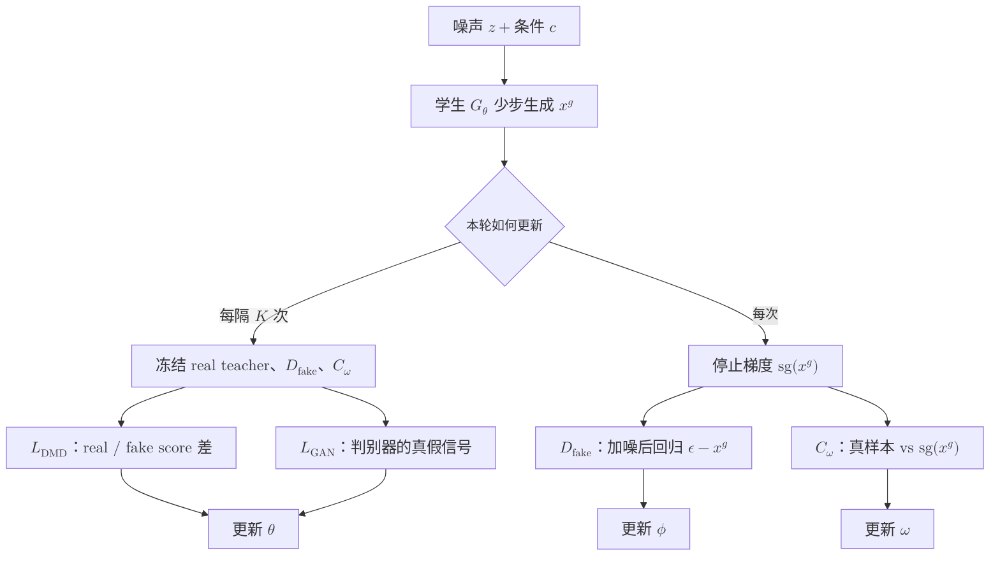
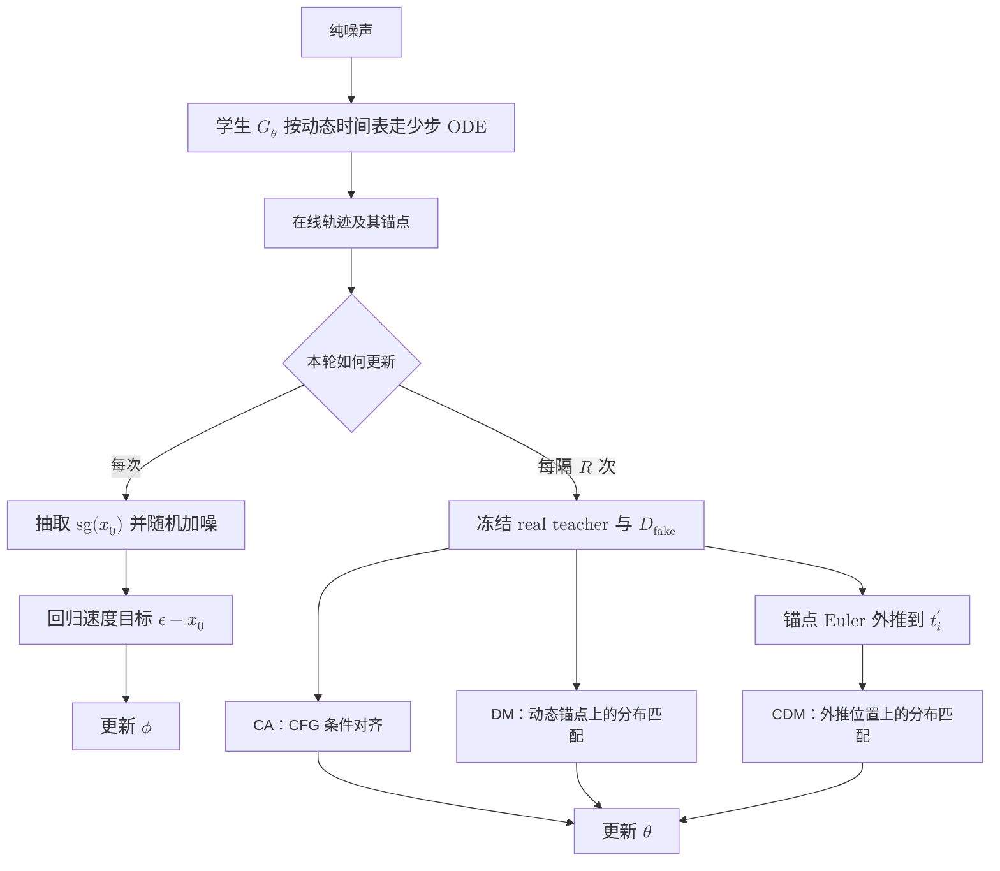

# 扩散模型的少步蒸馏：从分布匹配到连续时间

一个扩散模型可能训练得很好，却要调用几十次才能生成一张图。少步蒸馏要解决的就是这笔推理成本：训练一个学生，让它用一两步或少数几步，复现老师长轨迹最终形成的分布。

最直接的做法是回归老师生成的图片，但这会把“一对多”的生成问题压成“一对一”。Distribution Matching Distillation（DMD）换了一个目标：不追老师的某条轨迹，只追老师的分布。Continuous-Time Distribution Matching（CDM）沿着这条线继续向前，把约束从少数离散时间点铺到学生的连续轨迹上。

这篇文章只讲这条蒸馏路线：

```text
逐点回归 → DMD 的分布匹配 → CDM 的连续时间分布匹配
```

## 0. 预备知识：flow matching 在预测什么

先统一记号。设干净样本为 $x_0$，高斯噪声为 $\epsilon$，基于流匹配框架，对于 $t\in[0, 1]$，有如下扩散路径：

$$
x_t=(1-t)x_0+t\epsilon.
$$

$t=0$ 时是数据，$t=1$ 时接近纯噪声。对应的速度目标为

$$
v^*(x_t,t)=\epsilon-x_0.
$$

模型预测速度 $v_\theta$ 后，可以直接估计这条路径对应的干净样本：

$$
\hat{x}_0=x_t-t v_\theta(x_t,t).
$$

推理时，Euler 更新可以写成

$$
x_{t'}=x_t+(t'-t)v_\theta(x_t,t),\qquad t'<t.
$$

普通模型需要很多个很小的 $t \to t'$ 更新。DMD 和 CDM 的目标，都是让学生在步长很大时仍能落到正确的生成分布上。

## 1. 蒸馏的起点：不追轨迹，只追分布

### 1.1 从逐点回归到分布匹配

最直观的蒸馏方法，是先让老师从同一个噪声出发跑很多步，再让学生回归老师的最终输出。这种方法监督明确，但也有局限：老师轨迹的生成成本高，而且同一个 prompt 可以对应许多合理图片，逐点回归会把本来是“一对多”的生成问题压成“一对一”。

Distribution Matching Distillation（DMD）不要求学生复刻某一条老师轨迹。它只要求学生生成分布 $p_{\text{fake}}$ 接近老师或真实数据分布 $p_{\text{real}}$。其核心梯度来自两个 score 的差：

$$
\nabla_{x}D_{\mathrm{KL}}(p_{\text{fake}}\|p_{\text{real}})
\propto s_{\text{fake}}(x_t,t)-s_{\text{real}}(x_t,t).
$$

这里有两个“老师”：

- real teacher 是冻结的预训练模型，描述目标分布；
- fake teacher 是持续训练的扩散模型，拟合学生此刻产生的分布。

为什么必须有 fake teacher？因为仅知道目标分布往哪里推还不够。$s_{\text{fake}}$ 刻画学生当前分布已经在哪里，两个 score 相减才给出“从当前分布走向目标分布”的方向。当二者相等时，分布匹配梯度为零。

### 1.2 在 flow matching 中怎样得到这个方向

训练时不必显式计算概率密度。学生先从噪声生成 $x_0^g=G_\theta(z,c)$，再随机选择 $t$，把它重新加噪成

$$
x_t^g=(1-t)x_0^g+t\epsilon.
$$

real teacher 和 fake teacher 分别从同一个 $x_t^g$ 预测速度，再换算为干净样本估计：

$$
\hat{x}_0^{\text{real}}=x_t^g-t v_{\text{real}},\qquad
\hat{x}_0^{\text{fake}}=x_t^g-t v_{\text{fake}}.
$$

于是学生的更新方向可以写成

$$
g=\frac{\hat{x}_0^{\text{real}}-\hat{x}_0^{\text{fake}}}{Z},
$$

其中 $Z$ 是按样本计算的归一化因子，用来稳定不同噪声强度下的梯度尺度。训练时对 $g$ 停止梯度，再构造一个等价的伪回归目标：

$$
L_{\text{DMD}}
=\frac12\left\|x_0^g-\operatorname{sg}(x_0^g+g)\right\|_2^2.
$$

这个 MSE 只是把分布匹配方向传给学生的工具，并不意味着学生在回归某张真实图片。真正决定方向的仍是 real/fake 两个分布估计之差。

### 1.3 四个角色，最多三组可训练参数

fake teacher 的训练数据来自学生：对 $x_0^g$ 加噪后，以 $\epsilon-x_0^g$ 为速度目标做普通 flow matching 损失。学生一更新，$p_{\text{fake}}$ 就发生变化，fake teacher 因而必须不断跟随。

到了 DMD2，训练中实际存在四个角色，其中最多有三组参数参与更新：

- **real teacher**：冻结的预训练模型，只负责给出目标分布的 score；
- **student / generator $G_\theta$**：最终要保留下来的少步生成器；
- **fake teacher $D_{\mathrm{fake}}$**：参数为 $\phi$ 的可训练去噪模型，估计学生当前分布在各个噪声时刻的 score；
- **GAN discriminator $C_\omega$**：可选的真假分类器，用真实样本与学生样本训练。

fake teacher 和 discriminator 很容易被混为一谈，但二者并不等价。$D_{\mathrm{fake}}$ 接收带噪状态和时间，输出速度或 score，回答“学生分布在这里朝哪个方向变化”；$C_\omega$ 输出一个真假 logit，回答“这个样本更像真实数据还是生成数据”。前者构造 DMD 的分布梯度，后者提供直接来自真实数据的密度比信号。

### 1.4 GAN 的作用

只使用 DMD 梯度时，目标方向依赖冻结老师给出的 score。预训练老师并不等于真实数据分布本身，它的 score 估计误差会被学生继承；少步生成器还可能利用这些误差，落到老师判断尚可、真实感却不足的区域。

因此 DMD2 增加了一个轻量的对抗分支。判别器在真实样本 $x^{\text{real}}$ 与停止梯度的学生样本 $x^g$ 上最小化 logistic loss：

$$
L_D
=\mathbb{E}\left[\operatorname{softplus}(-C_\omega(x^{\text{real}}))\right]
+\mathbb{E}\left[\operatorname{softplus}(C_\omega(\operatorname{sg}(x^g)))\right].
$$

学生则增加对应的 non-saturating generator loss：

$$
L_{\text{GAN}}
=\mathbb{E}\left[\operatorname{softplus}(-C_\omega(x^g))\right].
$$

更新学生时冻结判别器参数，但保留 $C_\omega(x^g)$ 对 $x^g$ 的梯度，使真假信号能够传回 $G_\theta$。有些实现会先给真假 latent 加入随机强度的噪声再判别，这相当于让判别器在多个噪声尺度上比较两种分布，而不是死盯干净样本的局部纹理。

最终的训练目标可以概括为

$$
L=\lambda_{\text{DM}}L_{\text{DMD}}
+\lambda_{\text{GAN}}L_{\text{GAN}}.
$$

DMD 项提供老师分布与学生分布之间的方向，GAN 项把这个方向重新锚定到真实数据。GAN 是校正项，不是用判别器替代 real/fake score difference。

### 1.5 一次训练迭代怎样更新

把反向传播边界写清楚后，整个循环并不复杂：



更新学生时，real teacher、fake teacher 和 discriminator 的参数全部冻结，但它们对学生输出给出的梯度方向仍会传给 $G_\theta$。随后学生样本停止梯度，用来训练另外两组参数：$D_{\mathrm{fake}}$ 通过去噪损失追踪当前的 $p_\theta$，$C_\omega$ 通过真假分类损失学习数据分布与生成分布的差别。代码里这两项常被合并进同一个 guidance/critic optimizer step，但它们仍是作用不同的两种损失。

这里的 $K$ 体现 TTUR（Two-Time-Scale Update Rule）：critic 和判别器可以每次迭代都更新，学生则每隔若干次再更新。例如 $K=5$ 表示 guidance 连续更新五次，学生只更新一次。原因是学生一动，fake teacher 要拟合的分布也跟着动；若二者同速甚至学生更快，$s_{\text{fake}}$ 会长期滞后，学生拿到的就不是当前分布与目标分布之差。TTUR 的要点不是固定采用 $5{:}1$，而是让分布估计器有时间追上移动中的生成器。

DMD2 去掉昂贵的逐点回归后，正是靠这组不对称更新维持训练：real teacher 始终不动，fake teacher 快速跟随学生，判别器持续观察真假样本，学生在较慢的时间尺度上同时接收分布匹配与对抗梯度。

### 1.6 少步学生的训练分布问题

训练多步学生时，还有一个容易被忽略的问题。若直接对真实图加噪，学生看到的是 $q(x_t\mid x_0^{\text{real}})$；推理时它看到的却是自己上一大步产生的中间状态。步数越少，每一步误差越大，两种输入分布的差距也越明显。

DMD2 的 backward simulation 先让学生从纯噪声沿自己的少步轨迹回放，再从中抽取中间状态训练。这样，学生看到的就是推理时真正会遇到的输入分布。它解决的是 exposure bias，而不是改变 DMD 的分布匹配目标。

## 2. 蒸馏的延伸：把约束铺到连续时间

### 2.1 离散锚点留下了什么空隙

DMD 可以把几十步压到固定的 4 步或 8 步，但如果训练只约束几个预设时间点，学生便可能记住这些离散跳跃，而没有学到锚点之间完整、平滑的速度场。换一组采样时间，或者让单步跨度变大，累积误差就可能迅速暴露出来。

CDM 的全称是 Continuous-Time Distribution Matching。它把问题拆成两部分：先用动态的连续时间表覆盖学生真实会经过的轨迹，再把约束从轨迹上的锚点延伸到锚点之间的连续位置。目标不是让两个预测在数值上简单相等，而是让这些位置对应的生成分布都朝目标数据分布对齐。

为了把三项损失写在同一套记号里，下文用

$$
D_\theta(x_t,t,c)
=x_t-t v_\theta(x_t,t,c)
$$

表示学生从带噪 latent 中给出的干净样本估计。$D_{\mathrm{real}}$ 是冻结的 real teacher，$D_{\mathrm{fake}}$ 是参数为 $\phi$ 的在线 fake teacher，$\operatorname{sg}[\cdot]$ 表示停止梯度。

### 2.2 先从学生自己的 ODE 轨迹取样

每次训练先随机采样轨迹长度 $N\sim\mathcal U\{1,\ldots,N_{\max}\}$，再构造严格递减的连续时间表

$$
1=t_1>t_2>\cdots>t_N>0.
$$

用当前学生从纯噪声沿 ODE 反向生成：

$$
x_{t_{i+1}}
=x_{t_i}+(t_{i+1}-t_i)v_\theta(x_{t_i},t_i,c).
$$

这条轨迹不使用固定网格。训练从中均匀抽取一个锚点 $(x_{t_i},t_i)$，并先计算该位置的局部干净样本估计：

$$
\hat{x}_0^{(i)}=D_\theta(x_{t_i},t_i,c).
$$

$L_{\mathrm{CA}}$ 和 $L_{\mathrm{DM}}$ 都从这个 on-trajectory 估计出发。动态时间表改变的是锚点的覆盖范围，不是分布匹配的基本梯度。

### 2.3 锚点上的两项损失：CA 与 DM

第一项是 CFG Augmentation。将 $\hat{x}_0^{(i)}$ 重新加噪到独立采样的 $\tau\sim\mathcal U(0,1]$：

$$
z_\tau=(1-\tau)\operatorname{sg}[\hat{x}_0^{(i)}]+\tau\epsilon_\tau.
$$

冻结的 real teacher 分别计算 conditional 和 unconditional 预测，两者的差是 CFG 方向：

$$
\Delta_{\mathrm{CA}}
=\alpha\left[D_{\mathrm{real}}(z_\tau,\tau,c)-D_{\mathrm{real}}(z_\tau,\tau,\varnothing)\right],
$$

$\alpha$ 是 guidance scale。动态权重 $w_\tau$ 用来归一化梯度尺度，对应的伪回归损失为

$$
L_{\mathrm{CA}}
=\frac12\left\|
\hat{x}_0^{(i)}-
\operatorname{sg}\!\left[
\hat{x}_0^{(i)}+w_\tau\Delta_{\mathrm{CA}}
\right]
\right\|_2^2.
$$

第二项是锚点上的 Distribution Matching。它使用另一个独立噪声时刻 $\tilde\tau\sim\mathcal U(0,1]$：

$$
z_{\tilde\tau}
=(1-\tilde\tau)\operatorname{sg}[\hat{x}_0^{(i)}]
+\tilde\tau\epsilon_{\tilde\tau},
$$

然后计算 real/fake 差分

$$
\Delta_{\mathrm{DM}}
=D_{\mathrm{real}}(z_{\tilde\tau},\tilde\tau,c)
-D_{\mathrm{fake}}(z_{\tilde\tau},\tilde\tau,c),
$$

以及损失

$$
L_{\mathrm{DM}}
=\frac12\left\|
\hat{x}_0^{(i)}-
\operatorname{sg}\!\left[
\hat{x}_0^{(i)}+w_{\tilde\tau}\Delta_{\mathrm{DM}}
\right]
\right\|_2^2.
$$

$w_\tau$ 与 $w_{\tilde\tau}$ 是按样本计算的动态归一化权重。例如，CA 中可写为

$$
w_\tau
=\left\|D_{\mathrm{real}}(z_\tau,\tau,c)-\hat{x}_0^{(i)}\right\|_1^{-1}.
$$

$w_{\tilde\tau}$ 和 $w_{\hat\tau}$ 沿用同一形式，只需换成当前损失使用的加噪样本和局部干净样本估计。

这两个 MSE 都是传递梯度的伪目标。由于方括号内停止梯度，有

$$
\frac{\partial L_{\mathrm{CA}}}{\partial\hat{x}_0^{(i)}}
=-w_\tau\Delta_{\mathrm{CA}},\qquad
\frac{\partial L_{\mathrm{DM}}}{\partial\hat{x}_0^{(i)}}
=-w_{\tilde\tau}\Delta_{\mathrm{DM}}.
$$

梯度下降因而沿 $+\Delta$ 方向更新学生预测。$L_{\mathrm{CA}}$ 把老师的 CFG 方向传给学生；$L_{\mathrm{DM}}$ 则把学生当前分布推向老师的 CFG-free 条件分布。两者都没有回归某张真实图片。

从 score 角度看，flow matching 下的 Tweedie 公式给出

$$
D(z_u,u,c)=\frac{z_u+u^2\nabla_{z_u}\log p(z_u\mid c)}{1-u}.
$$

所以

$$
D_{\mathrm{real}}-D_{\mathrm{fake}}
=\frac{u^2}{1-u}
\left[s_{\mathrm{real}}(z_u,u,c)-s_{\mathrm{fake}}(z_u,u,c)\right].
$$

这正是 DMD 中的 real/fake score difference。这一次它被施加在动态采样的轨迹锚点上。

### 2.4 锚点外的损失：CDM

动态时间表扩大了锚点的覆盖范围，但每次损失仍只监督一个轨迹锚点。为了直接检查锚点之间的速度场，从 $(0,1]$ 独立采样 $t_i'$，并沿锚点处的速度做一次 Euler 外推：

$$
x_{t_i'}
=x_{t_i}
+(t_i'-t_i)v_\theta(x_{t_i},t_i,c).
$$

这里的 $t_i'$ 不要求小于 $t_i$。它与积分时间表独立，所以 $x_{t_i'}$ 可以落在相邻锚点之间，也可以超出当前的局部步长。由于真实 ODE 轨迹一般是弯曲的，这个线性外推点通常不在学生刚刚生成的轨迹上。

学生在外推点重新给出局部干净样本估计：

$$
\hat{x}_0^{(i')}
=D_\theta(x_{t_i'},t_i',c).
$$

再把它加噪到独立采样的 $\hat\tau\sim\mathcal U(0,1]$：

$$
z_{\hat\tau}
=(1-\hat\tau)\operatorname{sg}[\hat{x}_0^{(i')}]
+\hat\tau\epsilon_{\hat\tau}.
$$

外推点的 real/fake 方向与锚点 DM 形式相同：

$$
\Delta_{\mathrm{CDM}}
=D_{\mathrm{real}}(z_{\hat\tau},\hat\tau,c)
-D_{\mathrm{fake}}(z_{\hat\tau},\hat\tau,c),
$$

$$
L_{\mathrm{CDM}}
=\frac12\left\|
\hat{x}_0^{(i')}-
\operatorname{sg}\!\left[
\hat{x}_0^{(i')}+w_{\hat\tau}\Delta_{\mathrm{CDM}}
\right]
\right\|_2^2.
$$

$L_{\mathrm{DM}}$ 从轨迹锚点处的 $\hat{x}_0^{(i)}$ 回传。$L_{\mathrm{CDM}}$ 的路径还包含由锚点速度构造的 $x_{t_i'}$ 以及外推点上的局部预测 $D_\theta(x_{t_i'},t_i',c)$。这条路径直接约束大步 Euler 积分会遇到的 off-trajectory 区域。

结合以上三点，最终的损失函数为：

$$
L
=L_{\mathrm{CA}}+L_{\mathrm{DM}}+L_{\mathrm{CDM}}.
$$

三项损失的输入位置和职责可以归纳为：

| 损失 | 学生接受梯度的位置 | teacher 差分 | 直接作用 |
| ---- | -------------------------- | ------------ | -------- |
| $L_{\mathrm{CA}}$ | 动态轨迹锚点 | conditional $-$ unconditional real teacher | 补入 CFG 的文本对齐方向 |
| $L_{\mathrm{DM}}$ | 动态轨迹锚点 | real teacher $-$ fake teacher | 对齐 on-trajectory 分布 |
| $L_{\mathrm{CDM}}$ | 速度外推得到的锚点外位置 | real teacher $-$ fake teacher | 修补 inter-anchor inconsistency |

这三项只在 student update 时更新 $\theta$。real teacher 的 conditional、unconditional 预测以及 fake teacher 的预测都作为停止梯度的目标信号。

### 2.5 为什么 CDM 不需要 GAN

DMD2 引入 GAN，主要是为了修补离散分布匹配留下的画质问题。固定的少数时间点没有约束锚点之间的速度场，再叠加反向 KL 的 mode-seeking 倾向，学生容易产生过度平滑、纹理丢失和局部伪影。判别器直接比较真实样本与生成样本，能把这部分细节信号补回来。

CDM 选择从分布匹配本身入手。动态时间表让 $L_{\mathrm{DM}}$ 覆盖整个时间区间，$L_{\mathrm{CDM}}$ 又专门把 Euler 外推造成的锚点间漂移拉回目标分布；$L_{\mathrm{CA}}$ 则补上文本条件方向。原来需要 GAN 校正的细节损失，很大一部分来自监督位置过于稀疏，而不是 real/fake score difference 完全无法提供画质信号。把分布梯度放到更多轨迹位置后，CDM 可以只用 CA、DM 和 CDM 三项损失得到足够的监督，不必再训练一个真假判别器。

### 2.6 一次连续时间蒸馏怎样更新

由于 CDM 不再需要对抗分支，因此其涉及的参数角色只有三类：

- **real teacher** 始终冻结，提供 conditional、unconditional 和目标分布的速度预测；
- **student $G_\theta$** 产生少步 ODE 轨迹，也是最终保留的模型；
- **fake teacher $D_{\mathrm{fake}}$** 单独训练，持续拟合学生在线轨迹形成的分布。

一次外层迭代可以写成：



第一条分支只更新 $\phi$。在抽取的轨迹锚点上，先使用学生的局部预测 $\hat{x}_0^{(i)}$，再重新加噪：

$$
z_{\tau_\phi}
=(1-\tau_\phi)\operatorname{sg}[\hat{x}_0^{(i)}]
+\tau_\phi\epsilon_\phi.
$$

fake teacher 使用标准 flow matching 损失追踪学生当前分布：

$$
L_{\mathrm{fake}}
=\left\|
v_\phi(z_{\tau_\phi},\tau_\phi,c)
-\left(\epsilon_\phi-\operatorname{sg}[\hat{x}_0^{(i)}]\right)
\right\|_2^2.
$$

这一阶段不更新学生。第二条分支只更新 $\theta$：CA 中的 conditional/unconditional teacher 预测停止梯度；DM 和 CDM 中的 real/fake 预测也停止梯度，梯度穿过学生在轨迹锚点或外推位置上的预测。

$R$ 与前面的 TTUR 是同一个思想：fake teacher 更新得更频繁，学生更新得更慢。例如 $R=2$ 表示先做两次 fake-teacher update，再做一次 student update。这样学生计算 real/fake score difference 时，$D_{\mathrm{fake}}$ 描述的是较新的学生分布，而不是若干步之前的旧分布。

有些实现还会在 fake teacher 完成梯度更新后做一次很弱的参数融合：

$$
\phi\leftarrow\beta\phi+(1-\beta)\theta,
\qquad \beta\approx 1.
$$

这一步不是用 EMA 取代 fake teacher 的去噪训练，而是给它注入少量最新的学生参数，减轻两者长期漂移。另一个常见的 student EMA 只用于验证和保存更平滑的学生权重，不参与 real/fake score difference；两种 EMA 的用途不能混为一谈。

把更新顺序串起来看，动态时间表负责覆盖轨迹，fake teacher update 负责刷新学生分布的参照，CA 与 DM 约束轨迹内状态，CDM 约束大步外推。学生最终学到的才不是一串固定跳点，而是可在连续时间上使用的少步速度场。

## 3. 从离散分布匹配到连续速度场

DMD 与 CDM 不是两条并列路线。后者继承了前者的 real/fake score difference，也继承了 fake teacher 对学生分布的在线跟踪。变化发生在训练样本的位置：DMD 主要约束生成器输出或固定少步轨迹，CDM 进一步约束动态轨迹锚点以及锚点之间的外推状态。

| 方法 | 学生在哪里接受监督         | 核心更新方向               | 主要解决的问题             |
| ---- | -------------------------- | -------------------------- | -------------------------- |
| DMD  | 生成结果或固定少步轨迹     | real/fake score difference | 少步输出的分布是否正确     |
| CDM  | 动态轨迹锚点与连续外推位置 | CA + DM + CDM             | 大步采样时锚点之间是否自洽 |

两种方法最容易被忽略的共同点，是 fake teacher 必须比学生更新得更及时。它不是一个固定老师，而是学生当前分布的估计器。学生一动，它描述的对象就变了。无论采用哪种时间表，训练稳定性都依赖同一个条件：计算分布差之前，先保证“当前位置”的估计没有落后太远。

## 参考

- [DMD2](https://arxiv.org/abs/2405.14867)
- [Continuous-Time Distribution Matching](https://arxiv.org/abs/2605.06376)
