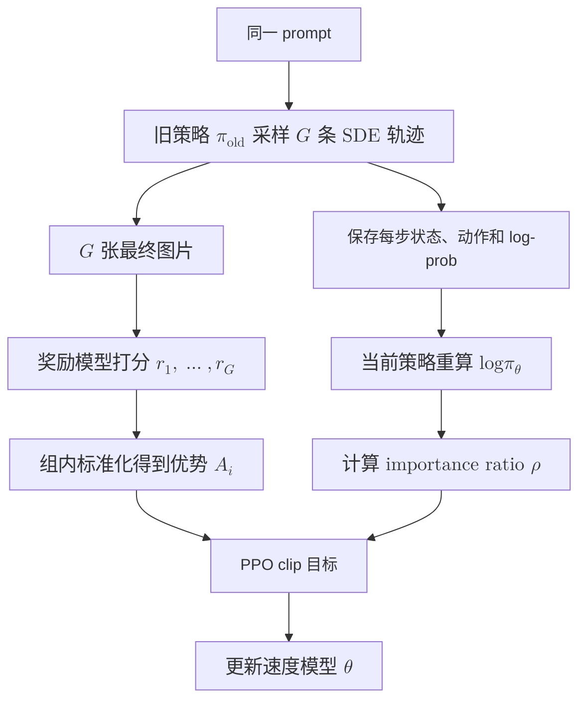

# 扩散模型的强化学习：如何把生成轨迹变成策略

对同一个 prompt 生成八张图，奖励模型很容易选出其中更好的几张。真正困难的是下一步：怎样把最终图片的分数，传回几十个去噪步骤？

语言模型可以直接计算每个 token 的概率。确定性的 flow matching 采样却只有一条 ODE 轨迹，下一状态由当前状态唯一决定，没有普通意义上可用于策略梯度的转移概率。Flow-GRPO 的关键不是把 GRPO 换个地方运行，而是先把生成过程改造成一个有概率密度的随机策略。

## 确定性 ODE 为什么没有可用的 log-prob

设 flow matching 模型在状态 $x_t$ 上预测速度 $v_\theta(x_t,t,c)$。确定性的 Euler 更新为

$$
x_{t-1}=x_t+\Delta t\,v_\theta(x_t,t,c).
$$

给定 $x_t$ 后，$x_{t-1}$ 已经确定。它对应的是一个退化的 Dirac 分布，无法像语言模型那样记录普通的 $\log\pi_\theta(x_{t-1}\mid x_t,c)$，也就不能直接构造 importance ratio。

解决方法是在采样时把 ODE 步改成随机的 SDE 步：

$$
x_{t-1}\sim
\mathcal{N}\left(\mu_\theta(x_t,t,c),\sigma_t^2I\right).
$$

均值 $\mu_\theta$ 仍由速度模型决定，额外噪声则让每一步都有明确的高斯转移密度。于是一次图片生成可以写成

$$
p_\theta(x_{0:T}\mid c)
=p(x_T)\prod_{t=1}^{T}
\pi_\theta(x_{t-1}\mid x_t,c).
$$

现在每个去噪步骤都有 log-prob，整条生成轨迹也就成了一条可以做 policy optimization 的随机决策序列。噪声在这里不只是增加多样性，它首先是在定义策略。

## 奖励只有一个，优势从组内比较得到

强化学习希望最大化

$$
J(\theta)
=\mathbb{E}_{x_0\sim p_\theta(\cdot\mid c)}
[r(x_0,c)].
$$

对同一个 prompt，用旧策略采样 $G$ 条轨迹，得到最终图片和奖励 $r_1,\ldots,r_G$。GRPO 不再训练一个单独的 value model，而是直接用组内均值和标准差构造优势：

$$
A_i=
\frac{r_i-\operatorname{mean}(r_1,\ldots,r_G)}
{\operatorname{std}(r_1,\ldots,r_G)+\varepsilon}.
$$

这个 baseline 消除了 prompt 难度差异。一个很难的 prompt 即使整组分数都低，其中相对更好的样本仍会得到正优势；一个容易的 prompt 即使绝对分数很高，低于组内平均的结果仍会被抑制。

图片只在轨迹结束时得到一次奖励。最简单的做法，是让同一条轨迹上被训练的所有去噪步共享这个优势 $A_i$。这不是精细的逐步 credit assignment，但避免了为图像生成再训练一个庞大的价值模型。

## 一次策略更新怎样发生

rollout 阶段使用旧策略，并保存每个随机步骤的状态、动作和 log-prob。得到组内优势后，当前策略重新计算同一批转移的 log-prob：

$$
\rho_{i,t}
=
\frac{\pi_\theta(x_{t-1}^i\mid x_t^i,c)}
{\pi_{\mathrm{old}}(x_{t-1}^i\mid x_t^i,c)}
=
\exp\left(
\log\pi_\theta-\log\pi_{\mathrm{old}}
\right).
$$

随后使用 PPO 风格的裁剪目标：

$$
L_{\mathrm{GRPO}}
=
-\mathbb{E}_{i,t}\left[
\min\left(
\rho_{i,t}A_i,\,
\operatorname{clip}(\rho_{i,t},1-\epsilon,1+\epsilon)A_i
\right)
\right].
$$

把数据流写开，就是：



采样与更新必须分开理解。旧策略负责产生训练数据，当前策略负责解释这些数据；importance ratio 修正二者的差别，clip 防止一次更新离采样策略太远。若还需要更强的约束，可以加入相对参考模型的 KL penalty。

## 为什么不必随机化整条轨迹

完整的 SDE rollout 要为每一步记录概率，更新时也要重算许多模型前向，成本很高。Flow-GRPO-Fast 采用了一个更直接的折中：大部分轨迹继续走确定性 ODE，只在随机选中的中间位置打开一个 SDE window。

```mermaid
%% caption: Flow-GRPO-Fast 的 SDE window
flowchart TB
  fastPrefix["共享 ODE 前缀"] --> fastWin["随机打开一个 SDE 窗口"]
  fastWin --> fastF1["分叉 1 · ODE 收尾"]
  fastWin --> fastF2["分叉 2 · ODE 收尾"]
  fastWin --> fastFg["$$\text{分叉 }G\text{ · ODE 收尾}$$"]
  fastF1 --> fastR["各自得到最终图片和奖励"]
  fastF2 --> fastR
  fastFg --> fastR
```

同一个 prompt 的多个样本可以共享分叉前的计算。训练也只需重算窗口内的随机步骤。只要最终图片仍由这些分叉状态决定，末端奖励就能为窗口内的动作提供学习信号。

代价同样明确：只训练少数步骤会引入偏差。窗口太窄，模型可调整的决策有限；窗口太靠近纯噪声，奖励信号很间接；窗口太靠近干净图片，低噪声区域的概率比又可能非常尖锐。窗口位置因此不是单纯的加速参数，而是在训练成本、探索空间和 credit assignment 之间做取舍。

## AIGC 的奖励函数设计

图像生成需要评价画质和文本要求是否满足，图像编辑还要检查原图中不该改变的内容。奖励通常涉及以下维度，再由规则或学习到的评分器给出分数。

### 奖励考虑哪些维度

- 指令遵循：对象、数量、颜色、空间关系是否符合要求，指定文字是否生成正确。
- 视觉质量：图像是否清晰、自然，有无结构错误和伪影，构图与美感如何。
- 内容保留：编辑后，未要求修改的背景、人物身份和局部细节是否保留。
- 任务特定目标：例如压缩性，用文件大小衡量，独立于语义和美观程度。

人类偏好往往综合前几个维度。它们也会冲突：要求“红杯子变蓝，其他不变”，原图不动保留得最好，却没有执行指令；重新生成一张漂亮照片，又可能换掉桌面和背景。

### 常用评分器

AIGC 任务的奖励通常是基于 VLM 结合相关规则进行打分。以 [DDPO](https://arxiv.org/html/2305.13301v3) 和 [Flow-GRPO](https://arxiv.org/html/2505.05470v1) 等论文的相关设计，主要有如下几类奖励：

- LAION 美学评分：从图像特征预测美观程度，不直接检查文本要求。
- GenEval：检测对象，按数量、颜色、位置和属性关系评分。
- OCR：比较识别文字与目标字符串，适合文字生成或替换；字符正确不代表排版正确。
- PickScore：输入文本和图片，预测人类偏好，用于偏好对齐。
- [HPSv3](https://arxiv.org/html/2508.03789v1)：输入文本和图片，直接输出偏好分数。它用成对偏好数据训练，将分数建模为高斯随机变量，推理时取均值 $\mu_\phi(x_0,c)$ 作为奖励；标准输入没有原图，无法直接评价内容保留。
- [EditReward](https://arxiv.org/html/2509.26346v2)：输入原图、编辑指令和结果图，用人类偏好数据训练，分别评价指令遵循和视觉质量。指令遵循包含“不做无关改动”，这是它与 HPSv3 的主要区别。
- [EditScore](https://arxiv.org/html/2509.23909v1)：生成评价理由和分数，以语义一致性检查指令执行与内容保留，再结合感知质量评分。
- [Edit-R1](https://arxiv.org/abs/2604.27505) 的 Edit-RRM：将指令拆成检查项，逐项评价后汇总，适合包含多个要求的编辑。

### 组合奖励函数

对于复杂的图像生成或编辑任务，通常需要考虑多个维度，相应的奖励函数也会进行组合设计。多个分数可以先校准尺度，再加权求和：

$$
r=w_{\mathrm{edit}}\tilde r_{\mathrm{edit}}
+w_{\mathrm{keep}}\tilde r_{\mathrm{keep}}
+w_{\mathrm{quality}}\tilde r_{\mathrm{quality}}.
$$

也可以采用几何平均，例如 EditScore 将语义一致性和感知质量合成为

$$
r=\sqrt{S_{\mathrm{SC}}\cdot S_{\mathrm{PQ}}}.
$$

加权和允许各项互相补偿，几何平均对低分项更敏感。无论采用哪种方式，最终都得到每张图片的一个标量奖励，用于计算组内优势 $A_i$。

## 训练时的监控

AIGC 的强化学习也会出现 reward hacking，为了明确 RL 的有效性，训练过程中至少需要同时观察：

- 训练 reward 与独立奖励模型；
- 生成多样性和重复模式；
- 各个噪声步骤的 importance ratio 分布；
- clip fraction 与参考模型 KL；
- 人工抽样检查。

importance ratio 还可能随噪声时间系统性漂移。理想情况下，更新开始时 $\rho$ 应以 1 为中心；实际的 flow matching 轨迹中，不同步骤的 ratio 偏差和方差可能差异很大，低噪声区域尤其明显。GRPO-Guard 的 RatioNorm 会按步骤校正 ratio 分布，再重新分配梯度权重。这个修正针对的不是奖励本身，而是 PPO 假设在不同噪声尺度上失真所造成的优化偏差。

## 它和少步蒸馏是什么关系

强化学习解决“模型应该偏好什么结果”，蒸馏解决“怎样用更少的调用生成这些结果”。两条路线可以组合，但不存在方法上的继承关系。

先做强化学习再蒸馏，可以把已经对齐奖励的模型压成少步学生；先蒸馏再做强化学习，可以降低 rollout 的调用次数，但策略能调整的空间也受少步学生限制。决定顺序之前，先确认当前瓶颈究竟是目标没有对齐，还是采样成本太高。

## 参考

- [Flow-GRPO](https://github.com/yifan123/flow_grpo)：Flow-GRPO、Flow-GRPO-Fast 与 GRPO-Guard。
