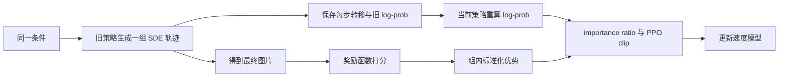

# 扩散模型的强化学习：如何把生成轨迹变成策略

对同一个 prompt 生成八张图，奖励模型很容易选出其中更好的几张。真正困难的是下一步：怎样把最终图片的一个分数，传回几十个去噪步骤从而完成策略模型的更新呢？

[Flow-GRPO](https://arxiv.org/abs/2505.05470) 提供了一个可行的思路。其把 flow matching 的去噪过程建模为 MDP；再把确定性 ODE 改写为具有相同边缘分布的 SDE，让每一步都有可计算的高斯概率；最后用组内相对优势和 PPO clip 更新这些转移概率。

## 从 rectified flow 到 MDP

Rectified flow 在数据 $x_0$ 和高斯噪声 $x_1$ 之间做线性插值：

$$
x_t=(1-t)x_0+t x_1,\qquad t\in[0,1].
$$

这里 $t=0$ 是干净数据，$t=1$ 是噪声。模型通过下面的 flow matching 目标回归速度场：

$$
\mathcal L_{\mathrm{FM}}(\theta)
=\mathbb E_{t,x_0,x_1}
\left[\left\|v_\theta(x_t,t,c)-(x_1-x_0)\right\|_2^2\right].
$$

生成时从 $x_1\sim\mathcal N(0,I)$ 出发，沿时间减小的方向积分

$$
\mathrm d x_t=v_\theta(x_t,t,c)\,\mathrm dt.
$$

去噪过程可以建模为 MDP：

| MDP 元素 | Flow matching 中的含义 |
|---|---|
| 状态 | $s_t=(c,t,x_t)$ |
| 动作 | $a_t=x_{t-h}$，即下一步 latent |
| 策略 | $\pi_\theta(a_t\mid s_t)=p_\theta(x_{t-h}\mid x_t,c)$ |
| 状态转移 | 动作一旦选定，下一个状态就是 $(c,t-h,x_{t-h})$ |
| 奖励 | 只在轨迹结束时给出 $R(x_0,c)$ |

其中 $h>0$ 表示反向积分的步长。这样写以后，一张图片的生成过程就是一条轨迹，最终图片的奖励则是这条轨迹的回报。

问题在于，原始 Euler 步

$$
x_{t-h}=x_t-hv_\theta(x_t,t,c)
$$

在给定 $x_t$ 后只有一个结果。它对应退化的 Dirac 条件分布，不能直接得到 PPO 所需的普通 log-prob。若从确定性连续流计算密度，还需要估计速度场的散度，计算代价很高。更重要的是，除了初始噪声以外，轨迹中没有新的随机动作，RL 很难在中间状态附近继续探索。

## ODE 与 SDE 之间的转换

[Yang et al.](https://arxiv.org/abs/2011.13456) 早已证明了扩散模型背后的 SDE 与 ODE 是可以互相转换的。总存在一个 SDE，其在每个时刻的边缘分布 $p_t(x)$ 与原 ODE 一致。

原 ODE 对应的连续性方程为

$$
\partial_t p_t(x)
=-\nabla\cdot\left[v_t(x)p_t(x)\right].
$$

考虑一般的正向 SDE：

$$
\mathrm d x_t=f_{\mathrm{SDE}}(x_t,t)\,\mathrm dt
+\sigma_t\,\mathrm d w_t.
$$

当 $\sigma_t$ 只依赖时间时，它的 Fokker-Planck 方程是

$$
\partial_t p_t(x)
=-\nabla\cdot\left[f_{\mathrm{SDE}}(x,t)p_t(x)\right]
+\frac{\sigma_t^2}{2}\nabla^2p_t(x).
$$

利用

$$
\nabla^2p_t(x)
=\nabla\cdot\left[p_t(x)\nabla\log p_t(x)\right],
$$

令 SDE 和 ODE 的概率演化方程相等，可以取

$$
f_{\mathrm{SDE}}(x,t)
=v_t(x)+\frac{\sigma_t^2}{2}\nabla\log p_t(x).
$$

这条正向 SDE 与原 ODE 共享边缘分布。根据反向时间 SDE 公式，反向过程的 drift 需要减去 $\sigma_t^2\nabla\log p_t(x)$，所以

$$
\mathrm d x_t
=\left[v_t(x_t)-\frac{\sigma_t^2}{2}\nabla\log p_t(x_t)\right]\mathrm dt
+\sigma_t\,\mathrm d\bar w_t.
$$

这里的“等价”是边缘分布等价。ODE 与 SDE 的单条轨迹不同，转移核也不同；相同的是理想连续时间下每个时刻的 $p_t(x)$。这正好满足 RL 的需要：保留原生成分布的演化，同时把每一步变成随机策略。

## v-prediction 与 score-prediction 的等价性

上式用分数 $\nabla\log p_t(x_t)$ 来表示，考虑到流匹配框架的目标是预测速度场，因此将上式转化为更一般的速度场形式。

给定 $x_0$，有

$$
p_{t\mid0}(x_t\mid x_0)
=\mathcal N\left((1-t)x_0,t^2I\right),
$$

所以条件 score 为

$$
\nabla\log p_{t\mid0}(x_t\mid x_0)
=-\frac{x_t-(1-t)x_0}{t^2}
=-\frac{x_1}{t}.
$$

对后验分布取期望，得到边缘 score：

$$
\nabla\log p_t(x_t)
=-\frac{1}{t}\mathbb E[x_1\mid x_t].
$$

另一方面，最优速度场是条件速度的期望：

$$
\begin{aligned}
v_t(x)
&=\mathbb E[x_1-x_0\mid x_t=x]\\
&=-\frac{x}{1-t}
+\frac{1}{1-t}\mathbb E[x_1\mid x_t=x]\\
&=-\frac{x}{1-t}
-\frac{t}{1-t}\nabla\log p_t(x).
\end{aligned}
$$

因此

$$
\nabla\log p_t(x)
=-\frac{x}{t}-\frac{1-t}{t}v_t(x).
$$

代回反向 SDE，得到如下用于随机采样的式子：

$$
\mathrm d x_t
=\left[
v_\theta(x_t,t,c)
+\frac{\sigma_t^2}{2t}
\left(x_t+(1-t)v_\theta(x_t,t,c)\right)
\right]\mathrm dt
+\sigma_t\,\mathrm d\bar w_t.
$$

## 策略的形式化

使用 Euler-Maruyama 离散上式。为了避免反向积分中时间增量符号造成歧义，这里用正数 $h$ 表示从 $t$ 到 $t-h$ 的步长：

$$
\begin{aligned}
\mu_\theta(x_t,t,c)
&=x_t-h\left[
v_\theta(x_t,t,c)
+\frac{\sigma_t^2}{2t}
\left(x_t+(1-t)v_\theta(x_t,t,c)\right)
\right],\\
x_{t-h}
&=\mu_\theta(x_t,t,c)+\sigma_t\sqrt h\,\epsilon,
\qquad \epsilon\sim\mathcal N(0,I).
\end{aligned}
$$

于是策略有显式的高斯密度：

$$
\pi_\theta(x_{t-h}\mid x_t,c)
=\mathcal N\left(
x_{t-h};\mu_\theta(x_t,t,c),\sigma_t^2hI
\right).
$$

若 latent 维数为 $d$，对应的 log-prob 为

$$
\log\pi_\theta
=-\frac{\left\|x_{t-h}-\mu_\theta\right\|_2^2}
{2\sigma_t^2h}
-\frac d2\log(2\pi\sigma_t^2h).
$$

整条生成轨迹的概率可以写成

$$
p_\theta(x_{0:T}\mid c)
=p(x_T)\prod_t
\pi_\theta(x_{t-h}\mid x_t,c).
$$

采用如下的噪声调度

$$
\sigma_t=a\sqrt{\frac{t}{1-t}},
$$

其中 $a$ 控制探索强度。$a$ 太小，组内样本差异不足；增大 $a$ 会加快奖励上升。

## 终点奖励怎样变成每一步的优势

对同一个条件 $c$，旧策略生成 $G$ 条轨迹，得到最终结果 $x_0^1,\ldots,x_0^G$ 和奖励 $R_1,\ldots,R_G$。Flow-GRPO 不训练 value model，而是做组内标准化：

$$
\hat A_i
=\frac{R_i-\operatorname{mean}(R_1,\ldots,R_G)}
{\operatorname{std}(R_1,\ldots,R_G)+\varepsilon}.
$$

同一条轨迹的所有时间步共享 $\hat A_i$。这是一种粗粒度 credit assignment。它不能判断某一步具体改善了图片，但能判断整条轨迹比同条件下的其他轨迹更好还是更差。

组内标准化也消除了 prompt 难度的平移差异。一个很难的 prompt 即使整组分数都低，相对更好的结果仍得到正优势；一个容易的 prompt 里，低于组均值的结果仍得到负优势。

## 从优势到 Flow-GRPO 目标

rollout 时保存旧策略的每步 log-prob。更新时固定同一组 $x_t$ 和 $x_{t-h}$，由当前策略重新计算 log-prob：

$$
r_t^i(\theta)
=\frac{
\pi_\theta(x_{t-h}^i\mid x_t^i,c)
}{
\pi_{\theta_{\mathrm{old}}}(x_{t-h}^i\mid x_t^i,c)
}
=\exp\left(
\log\pi_\theta-\log\pi_{\theta_{\mathrm{old}}}
\right).
$$

得到组内优势后，Flow-GRPO 的初步优化目标如下：

$$
\mathcal J_{\mathrm{clip}}(\theta)
=\frac{1}{G}\sum_{i=1}^{G}\frac{1}{T}\sum_t
\min\left[
r_t^i(\theta)\hat A_i,
\operatorname{clip}\left(r_t^i(\theta),1-\epsilon,1+\epsilon\right)\hat A_i
\right].
$$

如果 $\hat A_i>0$，优化会提高这条轨迹中动作的概率，但 ratio 超过 $1+\epsilon$ 后不再增加收益；如果 $\hat A_i<0$，则压低它们的概率，并由 $1-\epsilon$ 限制单次变化。旧策略负责产生训练数据，当前策略负责解释同一批数据，importance ratio 修正二者的差别。

与用于 LLM 的 GRPO 一致，Flow-GRPO 也使用 KL 散度约束（正则化），Flow-GRPO 最终的优化目标为：

$$
\mathcal J_{\mathrm{Flow\text{-}GRPO}}(\theta)
=\mathcal J_{\mathrm{clip}}(\theta)
-\frac{\beta}{GT}\sum_{i,t}
D_{\mathrm{KL}}\left(
\pi_\theta(\cdot\mid s_t^i)
\,\|\,
\pi_{\mathrm{ref}}(\cdot\mid s_t^i)
\right).
$$

策略与参考策略使用相同的协方差 $\sigma_t^2hI$，只在均值上不同，因此 KL 有闭式解：

$$
\begin{aligned}
D_{\mathrm{KL}}(\pi_\theta\|\pi_{\mathrm{ref}})
&=\frac{\|\mu_\theta-\mu_{\mathrm{ref}}\|_2^2}
{2\sigma_t^2h}\\
&=\frac h2
\left(
\frac{1}{\sigma_t}
+\frac{\sigma_t(1-t)}{2t}
\right)^2
\left\|v_\theta(x_t,t,c)-v_{\mathrm{ref}}(x_t,t,c)\right\|_2^2.
\end{aligned}
$$

这说明 KL 散度可以直接写成当前速度场和参考速度场之间的加权平方误差。设置合适的 KL 散度会减慢早期奖励上升，但能减少画质或多样性退化。

整条数据流可以压缩成：

## 训练技巧

完整 SDE rollout 需要多次模型前向，在线收集训练数据的成本很高。因此 Flow-GRPO 的 Denoising Reduction 在训练时只使用 10 个去噪步骤而非推理时的 40 步。

它依赖一个很实用的观察：用于 RL 的训练图片不必达到最终部署质量。只要 10 步生成的粗糙图片仍能让奖励函数区分好坏，轨迹就能提供有效的策略梯度。

## AIGC 的奖励函数设计

图像生成需要评价画质和文本要求是否满足，图像编辑还要检查原图中不该改变的内容。奖励通常涉及以下维度，再由规则或学习到的评分器给出分数。

### 奖励考虑哪些维度

- 指令遵循：对象、数量、颜色、空间关系是否符合要求，指定文字是否生成正确。
- 视觉质量：图像是否清晰、自然，有无结构错误和伪影，构图与美感如何。
- 内容保留：编辑后，未要求修改的背景、人物身份和局部细节是否保留。
- 任务特定目标：例如压缩性，用文件大小衡量，独立于语义和美观程度。

人类偏好往往综合前几个维度。它们也会冲突：要求“红杯子变蓝，其他不变”，原图不动保留得最好，却没有执行指令；重新生成一张漂亮照片，又可能换掉桌面和背景。

### 常用评分器

AIGC 任务的奖励通常是基于 VLM 结合相关规则进行打分。以 [DDPO](https://arxiv.org/html/2305.13301v3) 和 [Flow-GRPO](https://arxiv.org/html/2505.05470v1) 等论文的相关设计，主要有如下几类奖励：

- LAION 美学评分：从图像特征预测美观程度，不直接检查文本要求。
- GenEval：检测对象，按数量、颜色、位置和属性关系评分。
- OCR：比较识别文字与目标字符串，适合文字生成或替换；字符正确不代表排版正确。
- PickScore：输入文本和图片，预测人类偏好，用于偏好对齐。
- [HPSv3](https://arxiv.org/html/2508.03789v1)：输入文本和图片，直接输出偏好分数。它用成对偏好数据训练，将分数建模为高斯随机变量，推理时取均值 $\mu_\phi(x_0,c)$ 作为奖励；标准输入没有原图，无法直接评价内容保留。
- [EditReward](https://arxiv.org/html/2509.26346v2)：输入原图、编辑指令和结果图，用人类偏好数据训练，分别评价指令遵循和视觉质量。指令遵循包含“不做无关改动”，这是它与 HPSv3 的主要区别。
- [EditScore](https://arxiv.org/html/2509.23909v1)：生成评价理由和分数，以语义一致性检查指令执行与内容保留，再结合感知质量评分。
- [Edit-R1](https://arxiv.org/abs/2604.27505) 的 Edit-RRM：将指令拆成检查项，逐项评价后汇总，适合包含多个要求的编辑。

### 组合奖励函数

对于复杂的图像生成或编辑任务，通常需要考虑多个维度，相应的奖励函数也会进行组合设计。多个分数可以先校准尺度，再加权求和：

$$
r=w_{\mathrm{edit}}\tilde r_{\mathrm{edit}}
+w_{\mathrm{keep}}\tilde r_{\mathrm{keep}}
+w_{\mathrm{quality}}\tilde r_{\mathrm{quality}}.
$$

也可以采用几何平均，例如 EditScore 将语义一致性和感知质量合成为

$$
r=\sqrt{S_{\mathrm{SC}}\cdot S_{\mathrm{PQ}}}.
$$

加权和允许各项互相补偿，几何平均对低分项更敏感。无论采用哪种方式，最终都得到每张图片的一个标量奖励，用于计算组内优势 $A_i$。

## 训练时的监控

AIGC 的强化学习也会出现 reward hacking，为了明确 RL 的有效性，训练过程中至少需要同时观察：

- 训练 reward 与独立奖励模型；
- 生成多样性和重复模式；
- 各个噪声步骤的 importance ratio 分布；
- clip fraction 与参考模型 KL；
- 人工抽样检查。

importance ratio 还可能随噪声时间系统性漂移。理想情况下，更新开始时 $\rho$ 应以 1 为中心；实际的 flow matching 轨迹中，不同步骤的 ratio 偏差和方差可能差异很大，低噪声区域尤其明显。GRPO-Guard 的 RatioNorm 会按步骤校正 ratio 分布，再重新分配梯度权重。这个修正针对的不是奖励本身，而是 PPO 假设在不同噪声尺度上失真所造成的优化偏差。

## 它和少步蒸馏是什么关系

强化学习解决“模型应该偏好什么结果”，蒸馏解决“怎样用更少的调用生成这些结果”。两条路线可以组合，但不存在方法上的继承关系。

先做强化学习再蒸馏，可以把已经对齐奖励的模型压成少步学生；先蒸馏再做强化学习，可以降低 rollout 的调用次数，但策略能调整的空间也受少步学生限制。决定顺序之前，先确认当前瓶颈究竟是目标没有对齐，还是采样成本太高。

## 参考

- [Flow-GRPO](https://github.com/yifan123/flow_grpo)：Flow-GRPO、Flow-GRPO-Fast 与 GRPO-Guard。
