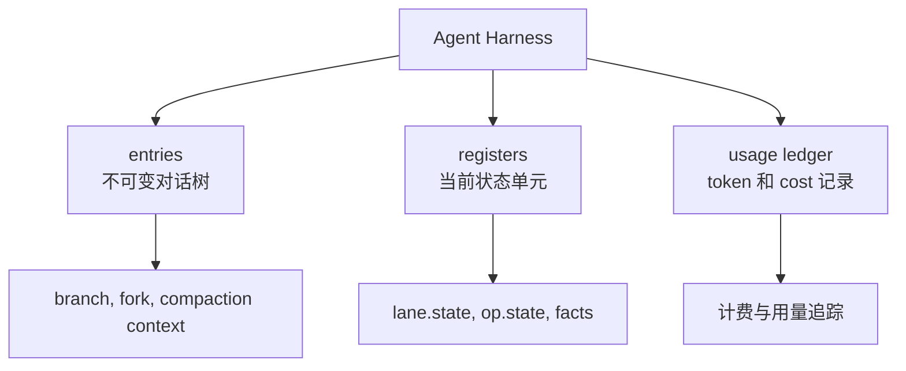
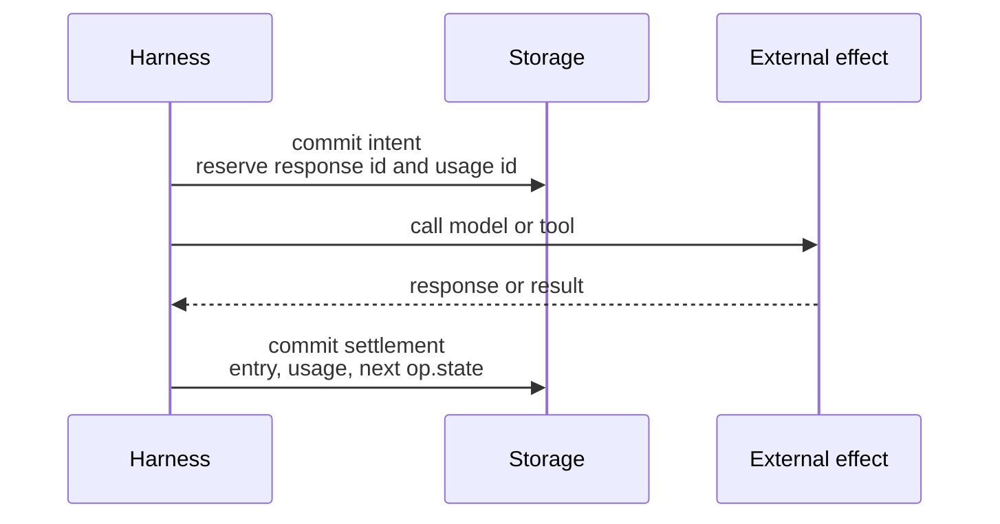
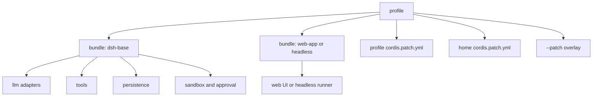
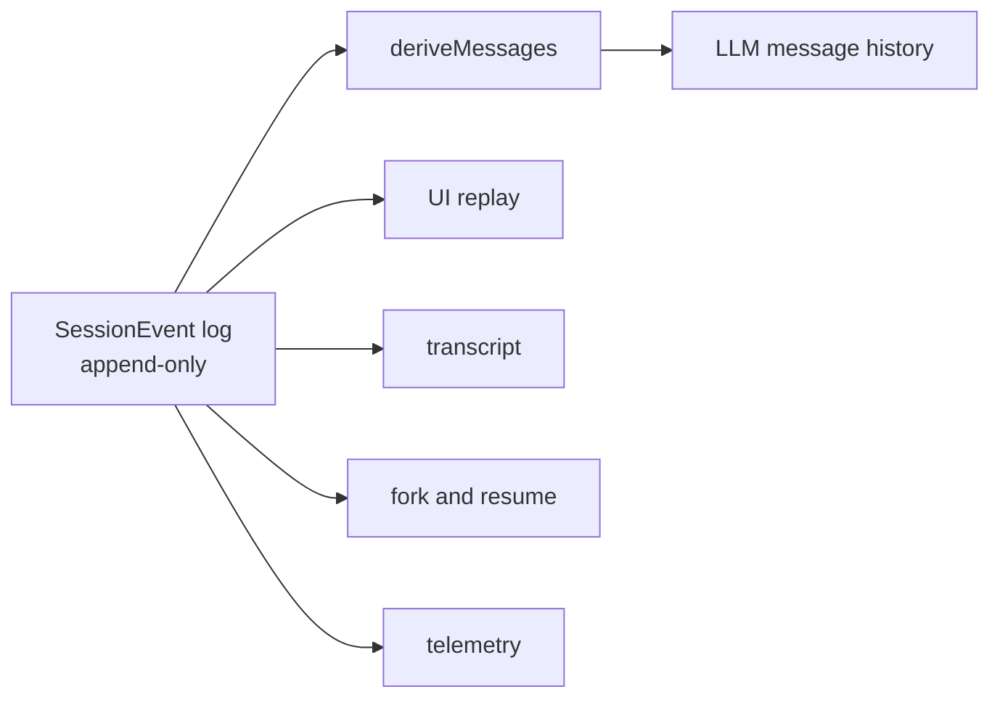
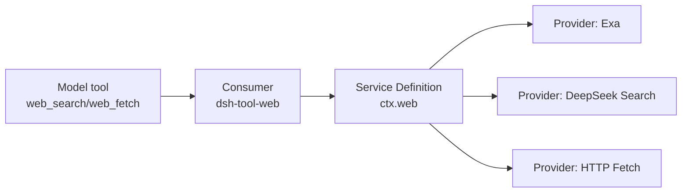
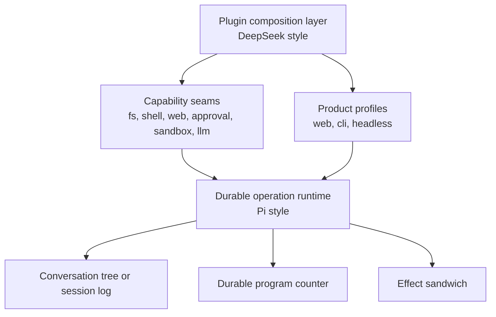

# Define Your Agent: Pi and DeepSeek Harness

如果你正在做一个 coding agent，最难的部分通常不是“让模型调用工具”。

真正难的是：工具跑到一半进程挂了怎么办？用户在工具执行期间插了一句话怎么办？同一个会话里要跑 subagent、compaction、fork、审批、沙箱、Web、文件系统，谁拥有这些能力？新能力加进来时，是改核心循环，还是挂到扩展点上？

Pi Agent Harness 和 DeepSeek Harness 给出了两种很不一样的答案。

Pi 的核心问题是：**一次 agent 工作如何在崩溃、恢复、分支和并行 lane 下仍然可解释。**

DeepSeek 的核心问题是：**一个 agent 产品如何被拆成可组合、可替换、可热插拔的能力系统。**

这两者都叫 harness，但它们关心的“抓手”不是同一个东西。

## 什么是 Agent Harness

Agent harness 不是一个简单的 LLM wrapper。

一个 wrapper 通常做这些事：

1. 把用户消息发给模型。
2. 解析工具调用。
3. 执行工具。
4. 把工具结果塞回模型。
5. 循环直到模型停止。

这只够 demo。

真正的 agent harness 要处理的是运行时问题：

- 对话历史如何持久化；
- 工具调用如何记录；
- 崩溃后从哪里恢复；
- 多个任务如何共享上下文但不互相踩；
- 文件系统、Shell、Web、审批、沙箱这些能力如何接入；
- UI、CLI、headless runner 是否共用同一套核心；
- compaction、fork、subagent、goal continuation 这些非普通聊天行为放在哪里。

换句话说，harness 是 agent 的操作系统雏形。

Pi 和 DeepSeek 的区别在于，Pi 更像一个**事务型运行时内核**，DeepSeek 更像一个**插件化 agent 操作系统**。

## Pi Agent Harness：把 agent 运行变成可恢复状态机

Pi Agent Harness 的设计一句话概括：

> 所有持久状态都落在三个地方，每一步都有明确 program counter，所有外部效果都被事务包住。

它的文档开头直接说自己是：

> A durable runtime for agent conversations. It persists conversation and operation state so interrupted work can resume without repeating settled effects.

这句话很关键。Pi 不是先问“怎么扩展”，而是先问“怎么不乱”。

### Pi 的三个存储：entries、registers、usage ledger

Pi 把所有 durable payload 限死在三个 store 里：

```text
entries        conversation tree，write-once，append-only
registers      current mutable state，namespaced typed cells
usage ledger   cost history，append-only rows
```

这不是普通的数据建模洁癖。它是在减少恢复时的歧义。



`entries` 是历史，写进去就不改。

`registers` 是当前状态，比如某条 lane 的 leaf 在哪里，当前 operation 走到了哪一步。

`usage ledger` 是用量账本。

最重要的是，没有第四个地方。没有一半存在内存里，一半存在日志里，一半靠事件重放猜出来。

这会让系统少很多“我以为它已经做了，但其实还没落盘”的幽灵状态。

## Pi 的 conversation tree 和 lanes：共享历史，分叉执行

Pi 不是把会话看成一个数组，而是看成一棵 entry tree。

```text
a ── b ── c ── d
      └── e ── f
```

每条 lane 是这棵树上的一个命名 cursor。默认有 `main`，也可以有 Slack thread、subagent、并行任务对应的 lane。

lane 不复制历史。它只记录自己的 leaf。

这带来一个很实用的模型：

- 两条 lane 可以共享前 400 条历史；
- 下一次 append 时自然分叉；
- fork 可以复制某个 path 或整棵 tree；
- compaction 改变模型上下文，但不等于删除历史；
- navigation 可以让 lane 跳到已有 entry。

Pi 这里的思想是：**历史是不可变结构，执行位置是可变指针。**

这比“每个 agent 都维护一份 messages 数组”更适合长期运行。messages 数组很好写 demo，但它很难回答这些问题：

- 这个工具结果属于哪个 assistant tool call？
- 这次 compaction 替换的是哪段上下文？
- subagent 是从哪个历史点分叉的？
- crash 后当前执行点到底在哪里？

Pi 用 tree 和 lane 把这些问题变成显式数据。

## Pi 的 durable program counter：恢复不是 replay，是读取当前状态

Pi 最硬核的部分是 `op.state/{operationId}`。

每个 operation 代表一次被接受的 lane 工作，比如 run、compaction、navigation。它有 immutable metadata，也有一个 total current state。

每一步之后，Pi 都会覆盖写入完整的 `op.state`。

```text
op.meta/O     写一次，记录 operation 身份和起点
op.state/O    每次 transition 覆盖，记录完整当前位置
lane.state    记录 lane 当前 operation
lane.leaf     记录 lane 当前 append 位置
```

恢复时不需要 replay 一串事件来推断“现在应该做什么”。它只读 register：

```text
read lane.state/main
read op.meta/O
read op.state/O
switch op.state.phase
continue
```

这就是文档里说的 durable program counter。

它的取舍很明显。

好处是恢复路径短，bug 面积小。你不需要写一个复杂 reducer，把历史日志从头扫到尾再推导当前执行状态。

代价是你必须认真设计 `OperationState`。它必须是 total state，不能依赖“上一个状态里曾经有什么”。

这是一种偏数据库、偏事务系统的思路。Pi 不相信“之后可以从日志猜出来”。Pi 要你在每一步把当前位置讲清楚。

## Pi 的 effect sandwich：承认外部世界不支持 exactly once

agent 最大的坑之一是外部效果。

模型请求可能已经扣费，但进程在收到响应前挂了。

工具可能已经删除文件，但进程在写入 tool result 前挂了。

Pi 没有假装自己能做到 exactly-once。它明确说 external effects 不是 exactly-once。然后它用一个结构把不确定窗口圈起来：

```text
commit:  about to do X; output will use ids R and U
do X:    provider request or real tool call
commit:  output + usage + next state
```

这就是 effect sandwich。



关键点是：**intent 在 effect 之前落盘。**

如果 crash 发生在 effect 中间，恢复时至少知道：

- 这个 effect 可能已经发生；
- 它原本要写入哪个 response id；
- 它是否允许 replay；
- 如果不允许 replay，要写 synthetic interrupted result，而不是再跑一次。

对于 destructive tool，比如删除文件，Pi 可以让工具声明 `replay: "never"`。如果 crash 发生在删除过程中，恢复时不会重跑删除，而是补一个合成错误结果，让对话结构保持完整。

这很工程化，也很诚实。

## DeepSeek Harness：把 agent 产品拆成插件树

DeepSeek Harness 的核心气质完全不同。

它的 README 开头说：

> 它采用一切皆插件的架构，并由 Cordis 驱动。

DeepSeek 不是先定义一个事务内核，再把 hooks 挂上去。它先定义一个 Cordis 插件世界：

- 插件向共享 context 贡献服务；
- 插件监听和发出类型化事件；
- 插件注册副作用，卸载时撤销；
- profile 和 bundle 组成运行时产品；
- patch 可以替换配置树中的任意条目。

它的架构文档里有一句很重要：

> 不存在需要打补丁的特权内核。

这就是 DeepSeek Harness 的中心思想。

不是“核心加扩展”。

而是“产品本身就是插件树”。

## DeepSeek 的 Cordis 插件树：配置即产品结构

运行中的 `dsh` 是一棵插件树。



profile 是用户选择的产品形态，比如 web 或 headless。

bundle 是一组 Cordis 配置和挂载代码。

patch 是覆盖层。它可以按 id 定位配置树中的条目，替换整个 config，或插入新条目。

这意味着 DeepSeek 的“架构边界”不只是代码 import 边界，也是运行时组合边界。

如果你要替换模型适配器、换 session persistence、换 sandbox、加一个工具、改一个审批策略，理想情况下不是去改 agent loop，而是改插件组合。

## DeepSeek 的三个事件域：持久事实、实时拦截、能力策略

DeepSeek Harness 的事件设计很有辨识度。它把事件分成几个域：

1. **会话事件**：追加到日志，是持久事实。
2. **Agent 事件**：携带活跃 Agent，用来观察或拦截进行中的工作。
3. **能力事件**：不导入 loop，也能给某个 seam 挂策略或适配器。

这解决的是“扩展点归属”问题。

比如一次 turn flow 大概是：

```text
turn/start
  claim input
  assemble prompt sections + tool schemas
  agent/pre-step
    step/start
    user/message
    derive model history from log
    agent/request -> llm/stream
    assistant/chunk*
    assistant/message
    tool/call* -> tools/pre-execute -> tools/execute -> tools/post-execute
    tool/result*
    step/end
  agent/turn-stopping
turn/end
```

其中：

- `turn/start`、`step/start`、`user/message`、`assistant/message`、`tool/result` 是持久 session events；
- `agent/pre-step`、`agent/request` 是实时 waterfall 扩展点；
- `tools/pre-execute`、`tools/execute`、`tools/post-execute` 属于工具能力流水线。

DeepSeek 的原则是：

> 模型可见的东西必须能从 session log 重建。

所以新增模型可见输入，不是偷偷塞进 request config，而是新增 session event，或者通过已有可投影事件进入日志。

这是 event-sourcing 的纪律。

## DeepSeek 的 session log：模型历史是派生物，不是存储物

DeepSeek 的 `Session` 是 append-only `SessionEvent` log。LLM message history 不是独立存储，而是通过 `deriveMessages()` 从 log 派生。



这和 Pi 有相似之处：都不喜欢 mutable messages array 成为唯一真源。

但两者重点不同。

Pi 的 durable state 分成 entries 和 registers。它关心 operation 恢复的当前位置。

DeepSeek 的 session log 是模型可见事实的真源。它关心所有插件、UI、持久化、回放、fork 都从同一条事件流派生。

DeepSeek 保留 raw `assistant/chunk`，同时也记录 assembled `assistant/message`。这对 UI replay 很重要。token 级流式效果不是临时动画，而是可以回放的事件。

## DeepSeek 的 capability seam：能力不是工具，工具只是消费方

DeepSeek 文档里反复出现一个词：seam。

一个 seam 包含三种角色：

1. **Service Definition**：声明接口。
2. **Service Provider**：实现能力。
3. **Consumer**：消费能力，通常是面向模型的工具。

以 Web 能力为例：

```text
dsh-web             定义 ctx.web
web-search-exa      search provider
web-search-deepseek search provider
web-fetch-http      fetch provider
dsh-tool-web        面向模型的 web_search/web_fetch 工具
```

这比“每个工具自己调用一个 SDK”要干净很多。

模型看到的是 `web_search`。背后 search provider 可以换。工具 schema、提示词引导、展示逻辑集中在 consumer。provider 只提供能力。



同样的模式也出现在：

- `ctx.fs` 文件系统；
- `ctx.shell` Shell；
- `ctx.sandbox` 进程沙箱；
- `ctx.approval` 用户审批；
- `ctx.subagents` 子 agent；
- `ctx.compaction` 压缩；
- `ctx.jobs` 后台任务；
- `ctx.llm` 模型适配器。

这是一种产品级架构，不只是库级 API。

## 两种 harness 的核心差异

如果只看表面，两者都有 session、tools、LLM、events、persistence。

但设计重心不同。

| 维度 | Pi Agent Harness | DeepSeek Harness |
|---|---|---|
| 核心问题 | 崩溃恢复和执行一致性 | 插件组合和能力替换 |
| 真源模型 | entries + registers + usage ledger | append-only SessionEvent log |
| 当前执行状态 | `op.state` durable program counter | live agent 状态 + session log + persistence seam |
| 对话结构 | conversation tree + lanes | session event surface + projections |
| 并行模型 | 多 lane 共享 tree，各自 cursor | 多 agent/session/插件作用域 |
| 外部效果 | effect sandwich，intent -> effect -> settlement | 工具流水线、审批、沙箱、持久事件和能力 seam |
| 扩展方式 | harness registries、hooks、events，核心状态机较强 | Cordis 插件、服务、事件、profile、bundle、patch |
| 哲学 | 不要从历史猜当前位置 | 不要让能力依赖特权内核 |
| 最适合 | 长任务、强恢复、精确 fork/lane 语义 | 产品平台、能力生态、多运行形态 |

一个粗暴但有用的判断：

- 如果你最怕“agent 做到一半挂了，恢复后重复删文件”，Pi 的设计更对味。
- 如果你最怕“每加一个能力都要改核心循环，最后产品变成硬编码泥球”，DeepSeek 的设计更对味。

## Pi 的设计思想：把不确定性缩到最小窗口

Pi 最值得学的是它对不确定性的处理方式。

它没有试图消灭所有不确定性。provider 请求、真实工具调用，这些外部效果本来就不完全受你控制。

Pi 做的是：

1. 在 effect 前写 intent；
2. 给输出预留 id；
3. effect 后写 settlement；
4. crash 后根据 durable program counter 恢复；
5. 对不可 replay 的 effect 写 synthetic result；
6. 让 conversation 结构始终闭合。

这是一种“事务外壳包住非事务世界”的设计。

它的美感在于克制。

Pi 没有说“我们能 exactly-once”。它说“我们知道哪里不是 exactly-once，而且只让不确定性存在于那里”。

对 agent 来说，这比很多华丽的 memory 系统更重要。

## DeepSeek 的设计思想：把核心循环变成可替换 spine

DeepSeek 最值得学的是它对能力边界的处理方式。

它不把 Bash、FS、Web、Subagent、Approval、Sandbox 都塞进 agent loop。它把 loop 保持为 spine：

```text
session -> system-prompt -> llm -> tools -> session
```

然后能力通过 `ctx.*` 服务和事件接入。

这有几个好处：

1. **替换 provider 不改变 consumer**  
   换 Web search 后端，模型工具 schema 不变。

2. **策略可以挂在能力边界**  
   审批、沙箱、文件访问策略，不必侵入工具实现。

3. **不同产品形态共用核心**  
   web UI 和 headless runner 是不同组合，不是不同代码分支。

4. **插件卸载有生命周期语义**  
   注册是 effect，卸载时 disposer 撤销注册。

5. **扩展点可被文档化**  
   新行为应该挂到哪个事件域，架构文档有明确映射。

DeepSeek 的强项不是“一个 operation 如何精确恢复到某个 phase”，而是“一个 agent 产品如何长期演化而不把核心写死”。

## 哪些地方值得互相借鉴

### DeepSeek 可以借鉴 Pi 的 operation program counter

DeepSeek 已经有 append-only session log 和 persistence seam，但 Pi 的 `op.state` 思路对长任务恢复很有价值。

尤其是这些场景：

- destructive tool crash recovery；
- deferred provider response；
- 多步骤 compaction；
- subagent handoff；
- 跨进程恢复 active operation；
- 用户审批后继续执行原 effect。

如果只靠 event log，恢复逻辑容易变成复杂 reducer。Pi 的 total current state 可以让“恢复当前 operation”变成一次点读。

### Pi 可以借鉴 DeepSeek 的 capability seam

Pi 的 harness spec 已经有 tools、prompt resources、hooks、events、runtime config，但 DeepSeek 的 seam 三分法更适合能力生态：

```text
Service Definition
Service Provider
Consumer
```

这能避免工具直接绑定 provider。

比如 `web_search` 工具不应该知道自己用 Exa、Perplexity 还是 DeepSeek Search。它应该消费一个 `web` seam。

同理，bash 工具不应该自己决定 sandbox 细节。它应该消费 shell/subprocess/sandbox seam。

Pi 如果走向更大的产品平台，DeepSeek 的 Cordis 化能力边界会很有参考价值。

## 如果你在设计自己的 agent harness，该先抄哪一个

先问你在做什么。

### 你在做 library 或嵌入式 agent runtime

优先学 Pi。

你需要：

- 清晰的 durable state；
- 明确的 operation lifecycle；
- crash recovery；
- lane/fork/branch；
- tool replay policy；
- atomic transition；
- 外部效果前后的 intent 和 settlement。

这会让你的 agent 不只是能跑，而是能活下来。

### 你在做 agent 产品或平台

优先学 DeepSeek。

你需要：

- 插件系统；
- profile 和 bundle；
- 可替换 LLM provider；
- 可替换 FS/Shell/Web/Subagent 后端；
- 审批和沙箱策略；
- UI、headless、SDK 共用一套核心；
- 能让外部开发者加能力，而不是 fork 你的 loop。

这会让你的产品不只是能演示，而是能长大。

### 你想做长期可用的 coding agent

两个都要。

我的理想结构大概是：



上层用 DeepSeek 的插件系统组织产品能力。

底层用 Pi 的事务状态机处理长任务、崩溃恢复和不可重复 effect。

这两个方向并不冲突。它们解决的是 agent harness 的不同痛点。

## 一个更深的判断：Pi 是时间模型，DeepSeek 是空间模型

Pi 的设计核心是时间。

它关心：

- operation 从哪个状态转到哪个状态；
- crash 发生在 effect 前、中、后分别怎么办；
- provider request 和 tool call 的 intent 何时落盘；
- lane leaf 如何随 append 变化；
- terminal transaction 如何清理状态。

DeepSeek 的设计核心是空间。

它关心：

- 哪个插件贡献哪个服务；
- 哪个事件域承载哪类扩展；
- 哪个能力 seam 由谁定义、谁实现、谁消费；
- profile 和 bundle 如何叠加；
- agent-local scope 如何隔离注册项。

一个把时间切清楚，一个把空间切清楚。

成熟的 agent 系统两个都需要。

## 结尾：不要再把 agent loop 当 while 循环了

很多 agent 框架的起点是：

```text
while true:
  call model
  if tool calls:
    run tools
  else:
    break
```

这个循环没错，但它只是 agent runtime 的最里层。

Pi Agent Harness 告诉你：这个循环的每一步都应该有 durable program counter，每个外部效果都应该有 intent 和 settlement。

DeepSeek Harness 告诉你：这个循环不应该认识所有能力，能力应该通过插件、服务、事件和 seam 进入系统。

如果你正在写自己的 harness，可以先做一个小测试：

1. 进程在工具删除文件后、写 tool result 前崩溃，你的系统会不会再删一次？
2. 想把本地 Bash 换成远程 sandbox，要不要改核心 loop？
3. UI 想回放 assistant streaming chunk，你有没有持久原始 chunk？
4. Web search provider 想从 A 换成 B，模型工具 schema 会不会跟着变？
5. subagent 从某个历史点分叉，你能不能说清它继承了什么，没有继承什么？

答不上来，不是坏事。

这说明你已经离开 demo 区，开始进入 harness 真正要解决的问题了。

## FAQ

### Agent harness 和 agent framework 有什么区别？

agent framework 通常强调开发体验，比如定义工具、调用模型、跑循环。agent harness 更强调运行时语义，比如持久化、恢复、扩展点、能力隔离、审批、沙箱和产品组合。两者会重叠，但 harness 更接近 agent 的运行底座。

### Pi Agent Harness 最核心的设计是什么？

最核心的是三个存储加 durable program counter。所有持久 payload 都在 entries、registers、usage ledger 中。当前 operation 的完整状态写在 `op.state` register 里，恢复时直接读取它，而不是从历史事件推断。

### DeepSeek Harness 最核心的设计是什么？

最核心的是 Cordis 驱动的一切皆插件。模型适配器、工具、会话日志、agent loop、沙箱、审批、Web、subagent 都通过插件、服务和事件组合。产品形态由 profile、bundle 和 patch 叠加出来。

### 做 coding agent 应该选哪种设计？

如果你先解决长任务可靠性，学 Pi。如果你先解决产品扩展性，学 DeepSeek。如果目标是长期可维护的 coding agent，最好把 Pi 的事务恢复模型和 DeepSeek 的插件能力模型结合起来。
