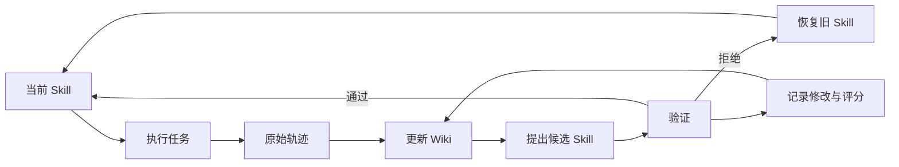

# A Glimpse into Recursive Self-Evolution: Skill Self-Evolution

对于 Agent，人们越来越认识到一个可靠的 Harness 有时能解决很多问题。与此同时，递归自我进化（Recursive Self-Evolution, RSI）在领域内也炙手可热，人们希望 AI 可以像人类一样，可以不断地学习以改进自己，对于 Agent 来说，这种进化有两个层面，一种是模型本身（Agent 的大脑），另一种则是 Harness。相比前者，后者的自进化要相对容易，因此也诞生了一系列关于 Harness 自进化的研究，这其中，Skill 自进化的研究最为广泛，也是本文的焦点。

Skill 提供了一个自然的载体：把操作流程、工具用法和失败处理写成可复用的文件，按需加载到 Agent 的上下文中。进一步，如果这些文件也能根据执行反馈自动更新，就形成了 **Skill 自进化**。

[SkillOpt](https://arxiv.org/abs/2605.23904)、[WikiSkill](https://arxiv.org/abs/2608.27454) 和 [SkillForge](https://arxiv.org/abs/2604.08618) 分别给出了三种实现思路：把 Skill 当作可训练的文本状态；为更新过程维护持久知识库；从领域任务的失败中定位 Skill 缺陷。下面沿着「执行 → 分析 → 修改 → 再执行」这条链路，看看它们具体怎么做。

## 1. 自进化发生在模型之外

一个 Agent 的表现由模型、工具、上下文和执行流程共同决定。模型权重固定以后，我们仍然可以通过调整这些外部组件改变它的行为，这也是 Harness 自进化关注的方向。本文主要讨论其中的 Skill 层：工具和执行框架保持稳定，持续优化 Agent 使用的程序性知识。

以论文复现为例，一份 Skill 可以规定：先读取配置和入口，再检查数据样例；启动完整训练前先跑一个 batch；遇到报错时收集哪些信息。这些规则会影响 Agent 的工具调用顺序和判断过程。

为了描述这类优化，记冻结模型为 $M_\theta$，执行框架为 $H$，当前 Skill 为 $s$。对任务 $x$ 执行一次，可以得到轨迹及其分数：

$$
(\tau,r)=H(M_\theta,x,s).
$$

轨迹 $\tau$ 包含消息、工具调用、执行结果和最终产物，$r$ 则由任务对应的评分方式给出。优化器读取这些反馈，提出候选 Skill，再通过实际执行比较候选的效果。

```text
当前 Skill → Agent 执行任务 → 轨迹与评分
    ↑                         ↓
保留有效更新 ← 验证候选 ← 分析并修改 Skill
```

[GEPA](https://arxiv.org/abs/2507.19457) 研究了用轨迹反思和候选搜索优化 Prompt；[EvoSkill](https://arxiv.org/abs/2603.02766) 则进一步把失败分析转化为可复用的 Skill 文件夹。接下来的几篇工作，把问题推进到了更新幅度、历史经验和领域归因这些更具体的环节。

## 2. SkillOpt：把 Skill 当作可训练的文本状态

直接让模型“根据失败重写 Skill”很容易得到一份更长的文档。新文档可能修复了当前问题，也可能把之前有效的规则改掉。[SkillOpt](https://arxiv.org/html/2605.23904v1) 因此借用了训练优化器的思路：收集一批执行反馈，生成有限数量的编辑，再用验证结果决定是否接受。

### 2.1 Rollout 与反思

每一步先让目标 Agent 带着当前 Skill 执行一批任务，保存工具调用、观察、答案和评分。优化器将成功和失败轨迹分开，按 minibatch 分析：失败轨迹用于寻找需要修正的流程，成功轨迹用于识别应该保留的行为。

这些分析最终变成结构化的编辑操作：

```text
add      增加缺失的步骤或条件
delete   删除无效或冲突的规则
replace  替换不准确的操作说明
```

多个 minibatch 的建议还要合并，处理重复、冲突和只针对某一道题的修改，之后才生成候选 Skill。这样，一次更新能同时参考多个任务的执行情况。

### 2.2 文本学习率

SkillOpt 用每步允许的编辑数量作为文本学习率。设合并后的编辑集合为 $\mathcal E_t$，本轮预算为 $L_t$，更新过程可以简写为：

$$
\Delta_t=\operatorname{Top}_{L_t}(\mathcal E_t),
\qquad
\tilde s_t=\operatorname{Apply}(s_t,\Delta_t).
$$

这里的排序由优化器完成，$L_t$ 限制采用多少条编辑。论文支持不同的预算调度方式，默认采用余弦调度，前期允许较多修改，后期逐渐收缩。

这个“学习率”控制的是文本编辑数量，没有对文字做数值反向传播。例如，先补上“调用诊断工具前检查必需参数”，再观察执行效果，比一次重写整套工具使用流程更容易判断修改的作用。

### 2.3 验证门槛与更新记忆

候选产生后，用独立的选择集 $D_{\mathrm{sel}}$ 计算平均分数：

$$
J_{\mathrm{sel}}(s)
=\frac{1}{|D_{\mathrm{sel}}|}
\sum_{x\in D_{\mathrm{sel}}}r(x;s).
$$

只有候选严格优于当前版本，才接受这次更新：

$$
s_{t+1}=
\begin{cases}
\tilde s_t, & J_{\mathrm{sel}}(\tilde s_t)>J_{\mathrm{sel}}(s_t),\\
s_t, & \text{otherwise}.
\end{cases}
$$

被拒绝的编辑会连同评分变化写入当前 epoch 的反馈缓冲区，后续反思可以看到哪些修改已经试过。此外，SkillOpt 还有 epoch 级的慢更新和优化器侧的经验整理，用于保留跨步骤的反馈。[官方方法介绍](https://microsoft.github.io/SkillOpt/)

整个过程对应一套清晰的数据划分：训练集产生修改依据，选择集决定采用哪个版本，测试集报告最终效果。部署时只导出选中的 `best_skill.md`，更新过程中的反思记录由优化器维护。

[作者报告](https://www.microsoft.com/en-us/research/blog/skillopt-agent-skills-as-trainable-parameters/)，SkillOpt 在六个 benchmark、七个目标模型和不同执行模式组成的 52 个评测单元中达到最好或并列最好。这个结果对应论文所测的设置；对实际系统而言，还需要把前期优化成本与后续 Skill 复用带来的收益一起计算。

## 3. WikiSkill：给 Skill 更新过程增加持久记忆

SkillOpt 保留了失败编辑的反馈。沿着这个方向继续考虑：当任务越来越多、更新轮数越来越长，优化器怎样组织这些经验？[WikiSkill](https://arxiv.org/html/2608.27454v1) 在执行轨迹和 Skill 之间加入了一个持久的 Wiki 层。

### 3.1 三层知识结构

它将不同用途的内容放在不同位置，结构可以概括为：

```text
raw/       原始执行轨迹
wiki/      从轨迹中整理的模式、证据和更新历史
skills/    当前交给执行 Agent 使用的操作方法
```

Wiki Maintainer 负责从成功和失败轨迹中整理模式；Skill Proposer 则通过 Wiki 索引，按需读取知识页和原始记录，提出新增或修订方案。每个 Skill 还通过 `PURPOSE.md` 关联到促成这次修改的 Wiki 模式。

因此，原始轨迹保留“发生过什么”，Wiki 组织“从中发现了什么”，Skill 则写清“执行时怎么做”。三者共同参与演化，但承担不同的作用。

### 3.2 回滚 Skill，保留更新历史

WikiSkill 同样要求候选严格提高验证分数才予以保留。没有改善时，Skill 恢复到上一个有效版本，Wiki 继续保存本轮积累的知识及修改结果。



可以用一个简单例子理解：某次修改增加了“遇到信息不全就询问用户”，却使已经能从历史消息中找到信息的任务也反复询问。这条修改可以撤回，关于它为什么没有改善结果的记录仍然留在 Wiki，供下一轮缩小规则的适用范围。

论文在五类任务上测试了这一机制。Qwen-3.6-27B 的五项平均测试分数由无 Skill 时的 39.4 提高到 63.3，报告结果取三次完整演化运行的平均值。实验将 Skill 正文直接注入执行模型，因此主要考察知识内容的作用；大规模技能库中的检索和自然触发还需要另外测试。

## 4. SkillForge：从业务失败定位到 Skill 缺陷

前两篇主要讨论更新过程如何组织。[SkillForge](https://arxiv.org/html/2604.08618v1) 面向云技术支持，关注领域 Agent 的一个实际问题：一次任务失败，究竟应该修改 Skill 的哪一部分？

### 4.1 从领域材料构建初始 Skill

SkillForge 先利用知识库和历史工单构建初始 Skill，把常见处理流程、工具使用方式和领域知识组织到技能文件中。这样，后续演化可以从已有业务经验出发。

Agent 使用当前 Skill 处理任务后，系统将回复与专家参考回复比较，收集存在偏差的案例，进入下面的诊断流程：

```text
执行失败 → Failure Analyzer → 聚合失败模式
        → Skill Diagnostician → 修改计划
        → Skill Optimizer → 新版本 Skill
```

### 4.2 失败分析与缺陷定位

Failure Analyzer 从四个维度分析执行情况：

| 维度 | 关注的问题 |
|---|---|
| 知识 | 领域知识缺失、错误，或已有知识没有被使用 |
| 工具 | 漏调用、参数错误、结果理解错误 |
| 澄清 | 应该询问的信息没有问，或重复询问已有信息 |
| 表达 | 回复冗长、机械，影响用户理解 |

这些案例按类别聚合后，由 Skill Diagnostician 读取当前 Skill，将反复出现的问题定位到具体内容，再交给 Skill Optimizer 修改。例如，漏调用可能对应工具触发条件缺失，参数错误可能对应参数说明不足。补充知识时，优化器还可以检索领域知识库。

这里的核心是把修改依据落到执行证据和文件位置上。对于一个缺少参数的工具调用，需要先查清参数是否已经存在于上下文，再判断应修改信息提取步骤，还是补充询问规则。

### 4.3 效果怎样衡量

论文实验包含五个云技术支持场景、1,883 张工单和 3,737 个任务，并按工单划分开发集与留出评测集。经过三轮更新，不同初始 Skill 的严格一致率提高约 9–12 个百分点。

这里的一致率由 LLM Judge 比较 Agent 回复与专家参考回复得到，反映的是回复的一致程度。线上工单解决率还会受后续交互和实际操作结果影响，两者需要分开统计。

## 5. 三种方法的联系

三篇工作更新的都是模型外部的程序性知识，侧重点各不相同：

| 方法 | 主要优化环节 | 保留下来的内容 |
|---|---|---|
| SkillOpt | 限制编辑幅度，通过选择集筛选更新 | 最优 Skill，以及优化器侧的更新经验 |
| WikiSkill | 将执行经验整理为长期可用的知识 | 当前 Skill、Wiki 和原始轨迹 |
| SkillForge | 将领域失败定位到具体 Skill 缺陷 | 修订后的领域 Skill 及诊断材料 |

它们可以为自动论文复现平台提供不同的设计参考。复现任务结束后，先从日志中识别有重复价值的问题，再定位到数据处理、训练启动或指标评估等阶段的 Skill；提出候选修改后，在其他任务上比较新旧版本；无效修改撤回，尝试过程继续保留。

```text
复现轨迹 → 经验整理 → 阶段 Skill 的候选修改
        → 同类任务验证 → 更新技能库 → 后续复现使用
```

在这样的流程中，经验写回和执行加载需要分别设计。写回侧负责整理证据、控制版本和验证更新；执行侧负责在合适的阶段找到并加载 Skill。一份改进过的 Skill 只有在后续任务中被正确使用，才能减少重复工作。

实际接入时，可以先选择一个反复出现的任务类型，固定模型、工具和预算，比较旧 Skill 与新 Skill 的执行结果。同时记录成功率、重复错误和总成本，再决定这条经验应该留在当前项目，还是扩大到更多仓库使用。

## 参考

- [SkillOpt: Executive Strategy for Self-Evolving Agent Skills](https://arxiv.org/abs/2605.23904)
- [WikiSkill: Compiling Agent Experience into Persistent Knowledge for Skill Evolution](https://arxiv.org/abs/2608.27454)
- [SkillForge: Forging Domain-Specific, Self-Evolving Agent Skills in Cloud Technical Support](https://arxiv.org/abs/2604.08618)
